# **Lab Guide: Setting Up a Python Environment with NumPy, Pandas, and Scikit-learn**

## **Table of Contents**

- [**Description**](#Description)  
- [**Problem Statement**](#Problem-Statement)  
- [**Prerequisites**](#Prerequisites)  
   - [**Software Required**](#Software-Required)  
   - [**Hardware Requirements**](#Hardware-Requirements)  
- [**Setup Instructions**](#Setup-Instructions)  
   - [**Setting Up a Python Environment with NumPy, Pandas, and Scikit-Learn**](#Setting-Up-a-Python-Environment-with-NumPy-Pandas-and-Scikit-learn)  
      - [**Step 1: Download the Python Installer**](#Step-1-Download-the-Python-Installer)
      - [**Step 2: Run the Installer**](#Step-2-Run-the-Installer)
      - [**Step 3: Choose the Optional Installation Features**](#Step-3-Choose-the-Optional-Installation-Features)
      - [**Step 4: Choosing Advanced Options**](#Step-4-Choosing-Advanced-Options)
      - [**Step 5: Add Python to Path (Optional)**](#Step-5-Add-Python-to-Path-Optional)
      - [**Step 6: Verify Python Was Installed on Windows**](#Step-6-Verify-Python-Was-Installed-on-Windows)
      - [**Step 7: Connect VS Code with Python**](#Step-7-Connect-VS-Code-with-Python)
      - [**Step 8: Install Libraries**](#Step-8-Install-Libraries)
      - [**Step 9: Verify Library Installation**](#Step-9-Verify-Library-Installation)
- [**Example Usage**](#Example-Usage)  
   - [**NumPy Example**](#NumPy-Example)  
   - [**Pandas Example**](#pandas-example)  
   - [**Scikit-Learn Example**](#Scikit-learn-Example)  
- [**Reference**](#Reference) 


---


## **Description**
This lab guide provides step-by-step instructions to set up a Python environment equipped with essential libraries such as NumPy, Pandas, and Scikit-learn, which are vital for data manipulation, analysis, and machine learning tasks.

---

## **Problem-Statement**
Setting up a Python environment with the right libraries is crucial for conducting data science and machine learning projects. This guide aims to simplify the process for beginners and provide a solid foundation for further exploration in AIML.

---

## **Prerequisites**

### **Software Required**

- **Python Installation:** Python version 3.11.9.

- **Libraries:** `numpy`, `pandas`, `scikit-learn`.

- **Visual Studio Code (VSCode)**: A lightweight code editor that provides powerful features for Python development, including extensions for linting, debugging, and version control.


### **Hardware Requirements**
- **Minimum System Requirements**:

  - **CPU:** Intel Core i3 or equivalent

  - **RAM:** 4 GB (8 GB recommended for better performance)

  - **Disk Space:** 1 GB free for Python and libraries installation

---

## **Setup-Instructions**

### **Setting-Up-a-Python-Environment-with-NumPy-Pandas-and-Scikit-learn**

**Step 1: Download the Python Installer:**

   

   - Visit the [official Python website](https://www.python.org/downloads/windows/).
   - Locate a reliable version of Python 3, **"Download Python 3.11.9"**.
   - Choose the correct link for your device from the options provided: either Windows installer (64-bit) or Windows installer (32-bit) and proceed to download the executable file. 
   

---

**Step 2: Run the Installer:**
   1. Run the downloaded Python Installer.

   2. The installation window shows two checkboxes:

      - **Admin privileges:** The parameter controls whether to install Python for the current or all system users. This option allows you to change the installation folder for Python.

      - **Add Python to PATH:** The second option places the executable in the PATH variable after installation. You can also add Python to the PATH environment variable manually later.

      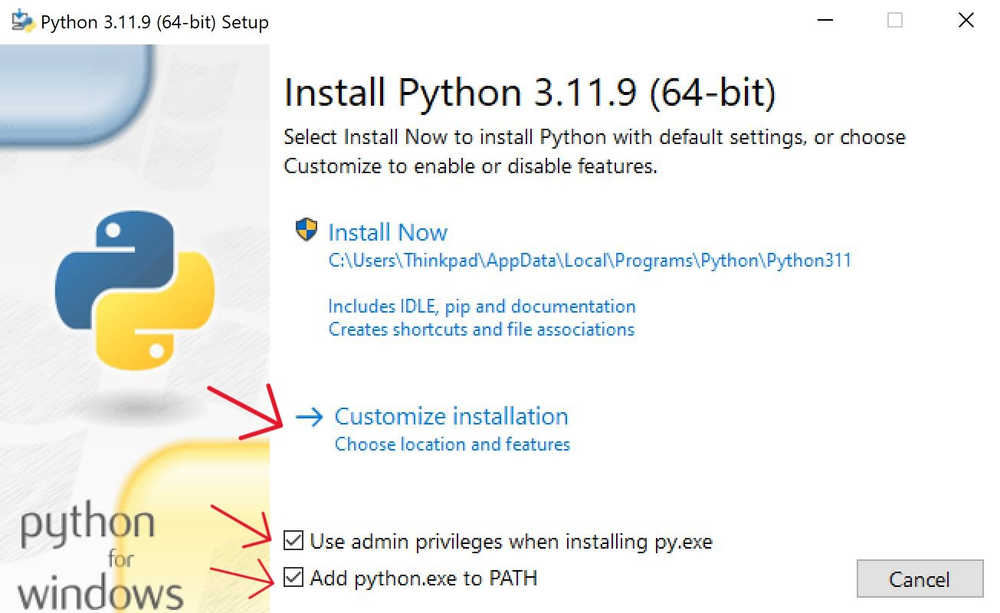
      <br>

   3. Select the **Install Now** option for the recommended installation (in that case, skip the next two steps).

   <br>

   4. To adjust the default installation options, choose **Customize installation** instead and proceed to the following step.

   - **Installation Directory:** `C:\Users\[user]\AppData\Local\Programs\Python\Python[version]`

   - **Included Components:**
     - **IDLE** (the default Python Integrated Development and Learning Environment).
     - **PIP** (Python's package installer).
     - **Additional Documentation.**
     
   - **The installer also creates:**
     - Required shortcuts.
     - File associations for `.py` files.

   If you choose the **"Customize Installation"** option during setup, you can modify the default configurations, such as the installation location, optional features, and advanced settings. This flexibility allows you to tailor the setup to your specific project requirements or environment.

---


**Step 3: Choose the optional installation features**
   - Python works without these features, but adding them improves the program's usability.

   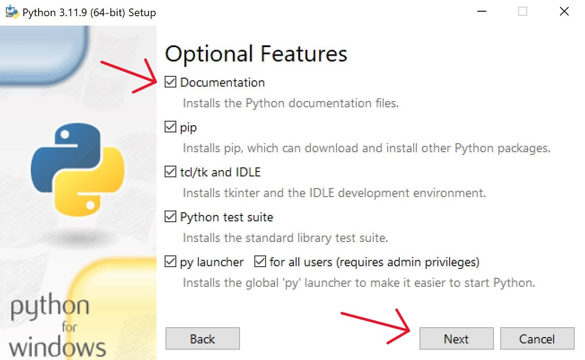

   - Click `Next` to proceed to the Advanced Options screen.

---
<br>

**Step 4: Choosing advanced options**
   - Choose whether to install Python for all users. The option changes the install location to C:\Program Files\Python[version]. 

   - If selecting the location manually, a common choice is C:\Python[version] because it avoids spaces in the path, and all users can access it.Due to administrative rights, both paths may cause issues during package installation.
  
   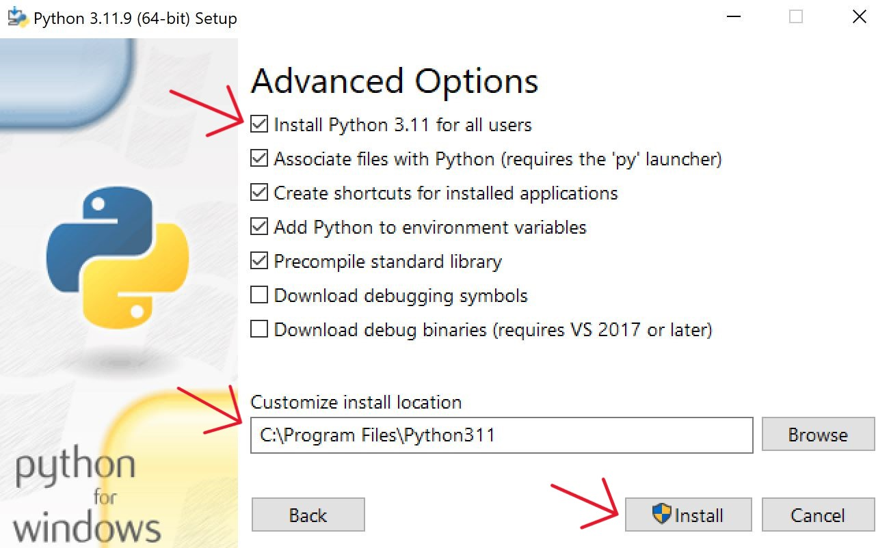
   <br>

   After picking the appropriate options, click Install to start the installation.
   <br>

   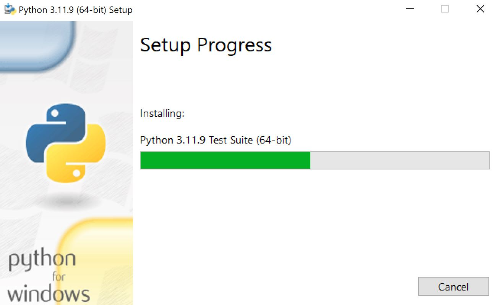

   <br>

   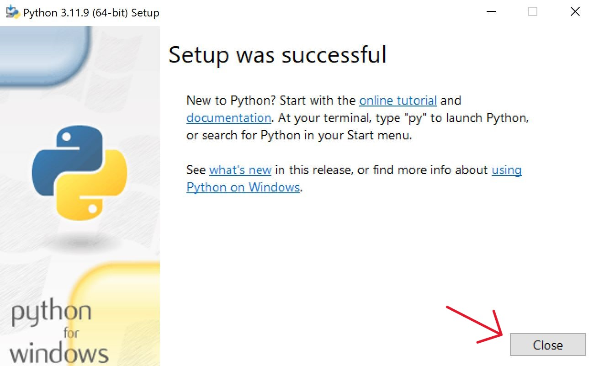

   Select the option and close the setup.

---
<br>


**Step 5: Add Python to Path (Optional)**

If the Python installer does not include the Add Python to PATH checkbox or you have not selected that option, continue in this step. Otherwise, skip to the next step.

To add Python to PATH, do the following:

#### 1. In the **Start menu**, search for **Environment Variables** and press **Enter**.

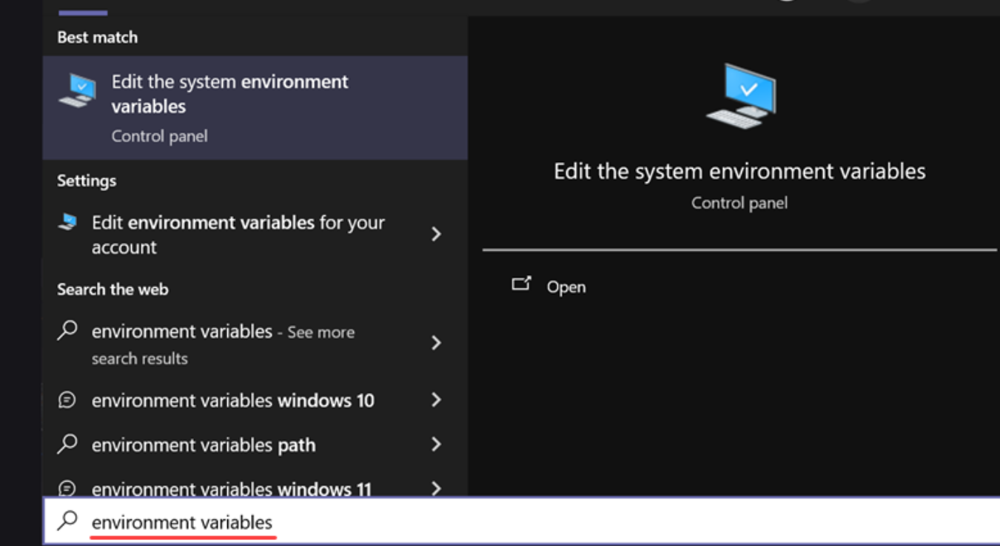


<br>

#### 2. Click **Environment Variables** to open the overview screen.

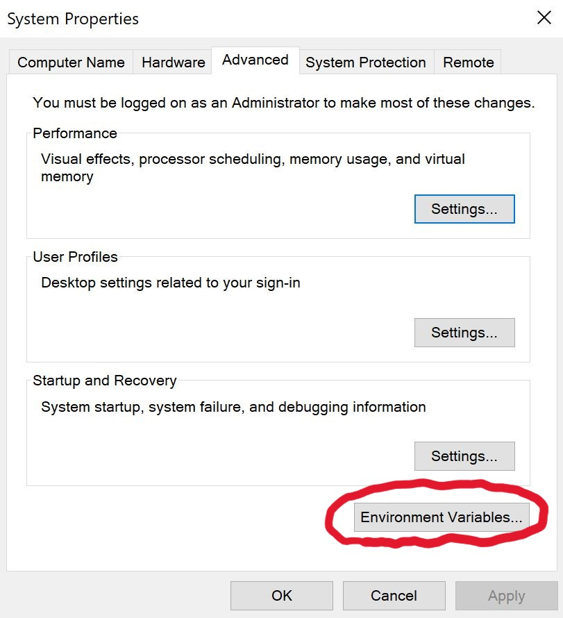


<br>

#### 3. Double-click **Path** on the list to edit it.

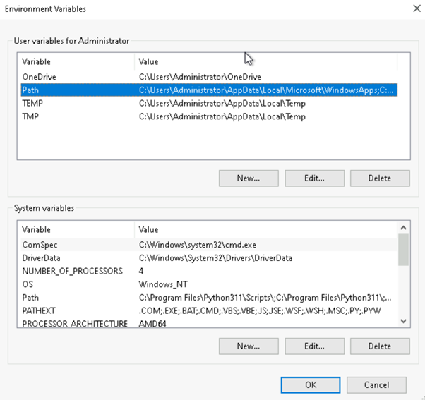

Alternatively, select the variable and click the Edit button.

<br>


#### 4. **Double-click the first empty field and paste the Python installation folder path for both system and user environmental variables for Administration**

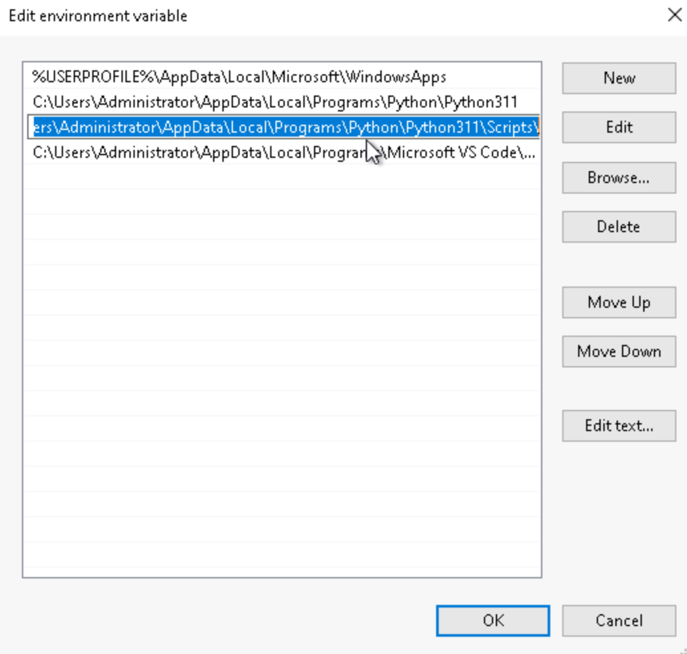

Alternatively, click the **New button** instead and paste the path. Click **OK** to save the changes.
<br>


---

**Step 7: Verify Python Was Installed on Windows**

The first way to verify that Python was installed successfully is through the command line. Open the command prompt and run the following command:

```bash
python --version
```

<br>

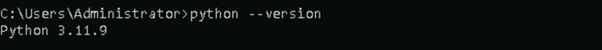

The output shows the installed Python version.
<br>


**Verify PIP Was Installed**

To verify whether PIP was installed, enter the following command in the command prompt:

```bash
pip --version
```


If it was installed successfully, you should see the PIP version number, the executable path, and the Python version:


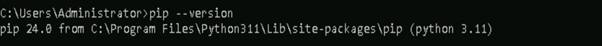
<br>

PIP has not been installed yet if you get the following output:

```
'pip' is not recognized as an internal or external command,
Operable program or batch file.
```

---


**Step 8: Connect VScode with Python**
To set up Visual Studio Code (VS Code) with Python, follow these steps:

**1. Install Visual Studio Code:**
   - Download and install the latest version of [Visual Studio Code](https://code.visualstudio.com/Download) for your operating system.


**2. Install the Python Extension for VS Code:**
   - Open VS Code.
   - Go to the **Extensions** view by clicking on the square icon in the left sidebar or pressing `Ctrl+Shift+X`.

   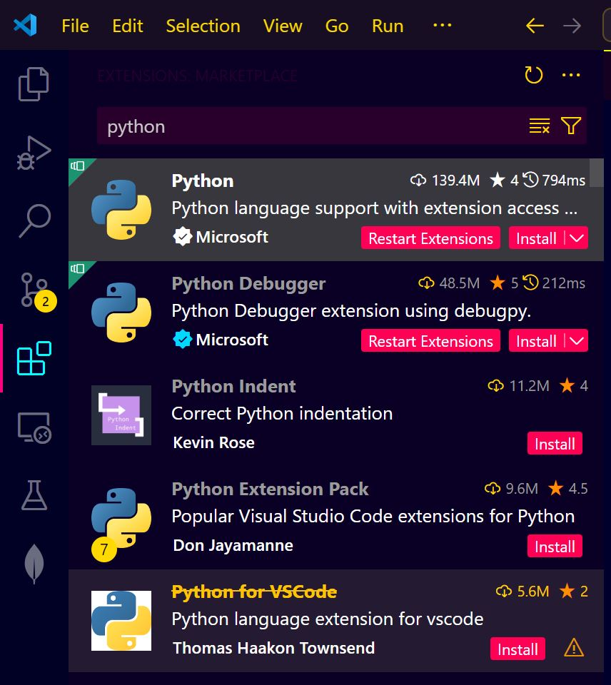

   - Search for the **Python** extension by Microsoft.


   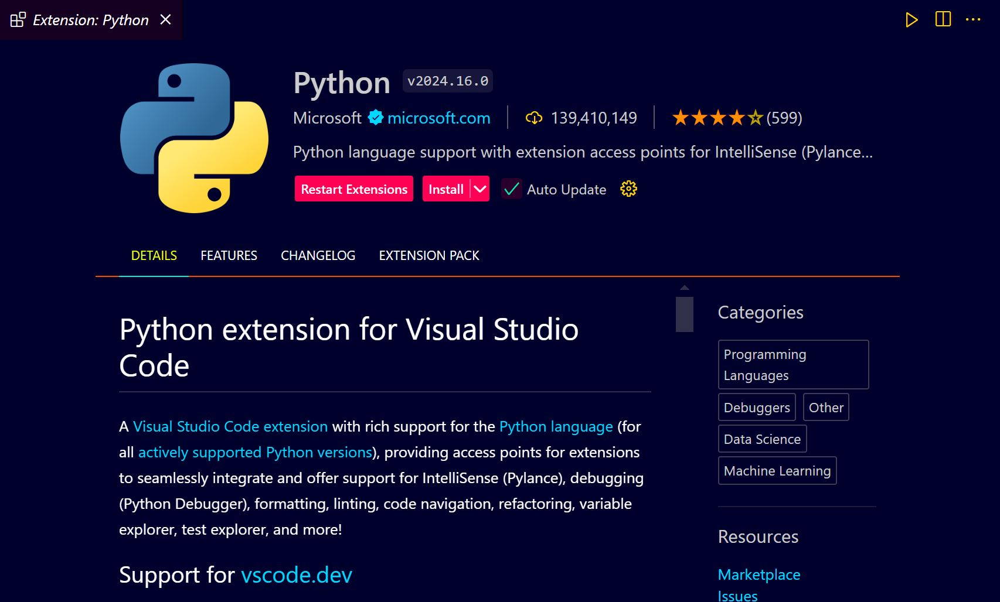


   - Click **Install** to add the extension to your VS Code.
   <br>


   - To select and set the Python interpreter in Visual Studio Code (VS Code), follow these steps:
      - **Open the Command Palette**: You can open the Command Palette by pressing `Ctrl+Shift+P`.

      - **Select Interpreter**: Type `Python: Select Interpreter` in the Command Palette and press Enter.

      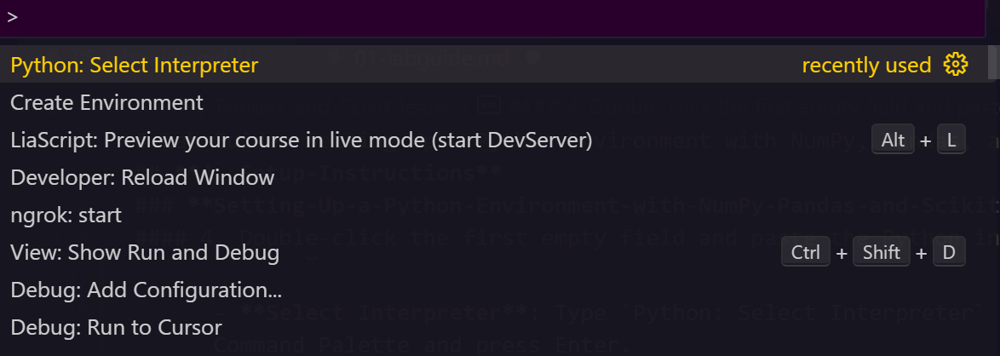

      - **Choose an Interpreter**: VS Code will display a list of available Python interpreters. Select the one you want to use. If you have a virtual environment or a specific Python installation, ensure it’s activated or listed here.

      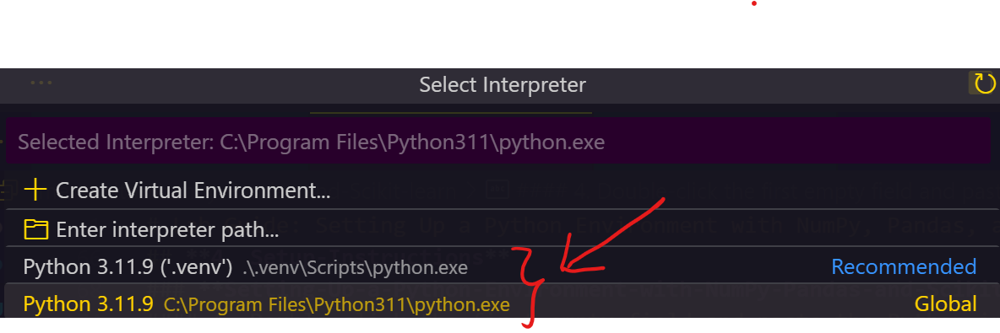

      - **Verify the Interpreter**: You can verify the selected interpreter by checking the bottom-left corner of VS Code. It should display the selected Python version and the path to the interpreter.

      - **Set Interpreter Path Manually**: If the desired interpreter is not listed, you can manually set the interpreter path in the `settings.json` file by adding or modifying the following line:

      ```json
      "python.pythonPath": "path/to/your/python"
      ```

      Replace `"path/to/your/python"` with the actual path to the Python interpreter.


**3. Create a Python File:**
   - Open a new file in your workspace.

   - Save it with the `.py` extension (e.g., `main.py`).
   <br>


**4. Write and Run Python Code:**
   - Type a simple Python script, such as:

     ```python
     print("Hello, World!")
     ```

   - Save the file.

   
**Run the Python file**
- Use the command below in your terminal to run the Python file:
 
```bash
python main.py
```

   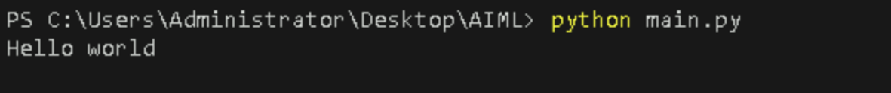

   This is the terminal output (Hello World)
   <br>


**Step 9: Install Libraries**

To install the essential libraries, open your command prompt and run the following command:

```bash
pip install numpy pandas scikit-learn
```
<br>

This command will install NumPy, Pandas, and Scikit-learn, which are essential for data manipulation, analysis, and machine learning tasks.

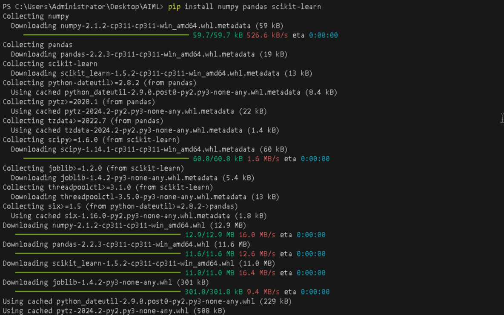

---


**Step 9: Verify Library Installation**

To verify the installation, you can run a simple script that imports the libraries and prints their versions. Follow these steps to create and run the script in Visual Studio Code (VS Code):


**1. Open VS Code**
   - Launch Visual Studio Code from your Start menu or desktop shortcut.
   <br>

**2. Create a New Python File**
   - Click on `File > New File` or press `Ctrl+N` to create a new file.

   - Save the file with a `.py` extension, e.g., `verify_libraries.py`, by clicking on `File > Save As` or pressing `Ctrl+S`.

   <br>

**3. Write the Verification Script**
   - In the new file, type the following Python script:

   ```python
   import numpy as np
   import pandas as pd
   import sklearn

   print("NumPy version:", np.__version__)
   print("Pandas version:", pd.__version__)
   print("Scikit-learn version:", sklearn.__version__)
   ```


**Run the Python file**
- Use the command below in your terminal to run the Python file:
 
```bash
python verify_libraries.py
```

**Output**

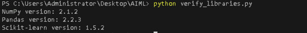
   
   <br>
---

## **5. Example-Usage**

### **NumPy-Example**


- **Create a new python file**
  - Create a Python file named `creating_array.py` and write the following code in it.
   

NumPy is a powerful library for numerical computations. Here are two simple examples to demonstrate its capabilities:

**Example 1: Creating and Manipulating Arrays**

```python
import numpy as np

# Create a 1D array
array = np.array([1, 2, 3, 4, 5])
print("1D Array:", array)

# Perform element-wise multiplication
result = array * 2
print("Element-wise Multiplication Result:", result)
```


**Run the Python file**
- Use the command below in your terminal to run the Python file:
 
```bash
python creating_array.py
```


**Output:**

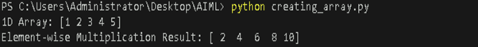
<br>

---

**Example 2: Matrix**

- **Create a new python file**
  - Create a Python file named `matrix.py` and write the following code in it.
   

```python
import numpy as np

# Step 1: Create two small matrices
matrix_A = np.array([[1, 2], 
                      [3, 4]])

matrix_B = np.array([[5, 6], 
                      [7, 8]])

print("Matrix A:")
print(matrix_A)

print("\nMatrix B:")
print(matrix_B)

# Step 2: Perform basic operations

# Matrix addition
matrix_sum = matrix_A + matrix_B
print("\nSum of Matrix A and B:")
print(matrix_sum)

# Matrix subtraction
matrix_diff = matrix_A - matrix_B
print("\nDifference of Matrix A and B:")
print(matrix_diff)

# Element-wise multiplication
matrix_product = matrix_A * matrix_B
print("\nElement-wise Product of Matrix A and B:")
print(matrix_product)

# Matrix multiplication
matrix_mul = np.dot(matrix_A, matrix_B)
print("\nMatrix A multiplied by Matrix B:")
print(matrix_mul)

# Step 3: Transpose of a matrix
matrix_A_T = matrix_A.T
print("\nTranspose of Matrix A:")
print(matrix_A_T)

# Step 4: Determinant of a square matrix
determinant_A = np.linalg.det(matrix_A)
print("\nDeterminant of Matrix A:", determinant_A)

# Step 5: Inverse of a matrix
matrix_A_inv = np.linalg.inv(matrix_A)
print("\nInverse of Matrix A:")
print(matrix_A_inv)

# Verification: Matrix A multiplied by its inverse
identity_matrix = np.dot(matrix_A, matrix_A_inv)
print("\nMatrix A multiplied by its Inverse (should be Identity Matrix):")
print(identity_matrix)
```


**Run the Python file**
- Use the command below in your terminal to run the Python file:
 
```bash
python matrix.py
```


**Output**

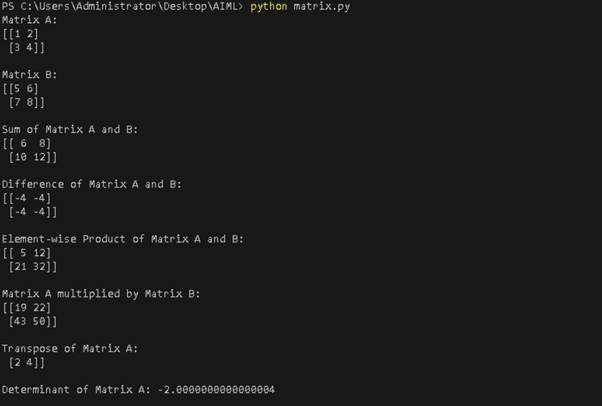
<br>

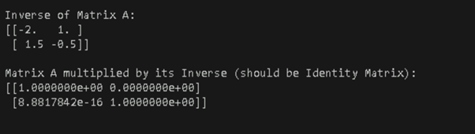

---


### **Pandas-Example**

- **Create a new python file**
  - Create a Python file named `creating_dataframe.py` and write the following code in it.
   
Pandas is used for data manipulation and analysis. Here are two examples of creating and manipulating DataFrames:

**Example 1: Creating a DataFrame**

```python
import pandas as pd

# Create a DataFrame
data = {'Name': ['Alice', 'Bob', 'Charlie'],
        'Age': [25, 30, 35],
        'City': ['New York', 'Los Angeles', 'Chicago']}
df = pd.DataFrame(data)
print("DataFrame:\n", df)
```


**Run the Python file**
- Use the command below in your terminal to run the Python file:
 
```bash
python creating_dataframe.py
```


**Output:**

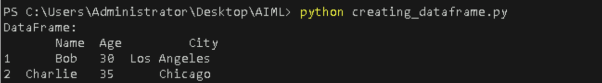
<br>

---

**Example 2: Filtering a DataFrame**

- **Create a new python file**
  - Create a Python file named `filtering_dataframe.py` and write the following code in it.
   

```python
import pandas as pd

# Create a DataFrame
data = {'Name': ['Alice', 'Bob', 'Charlie', 'David'],
        'Age': [25, 30, 35, 28],
        'City': ['New York', 'Los Angeles', 'Chicago', 'Boston']}
df = pd.DataFrame(data)
print("Original DataFrame:\n", df)

# Filter DataFrame for Age greater than 28
filtered_df = df[df['Age'] > 28]
print("Filtered DataFrame:\n", filtered_df)
```


**Run the Python file**
- Use the command below in your terminal to run the Python file:
 
```bash
python filtering_dataframe.py
```


**Output:**

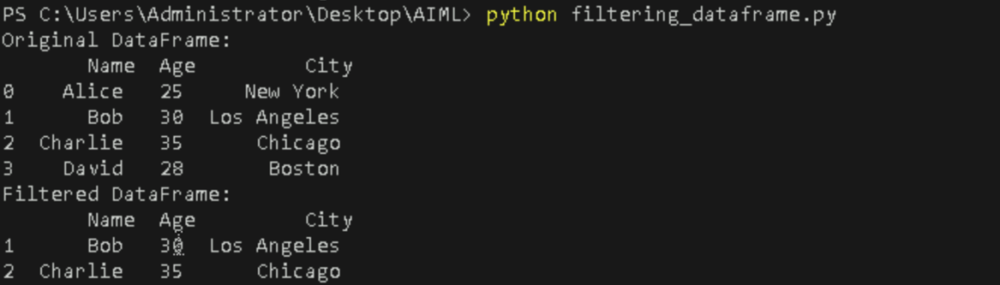
<br>

---

**Example 3: Load the CSV into a DataFrame**

- **Create a new python file**
  - Create a Python file named `analysing_data.py` and write the following code in it.
   
- **Downloading the Dataset**

  - Go to the [**Kaggle website**](https://www.kaggle.com/) and sign in to your account. If you don’t have an account, create one.

  - Navigate to the [**House Prices: Advanced Regression Techniques**](https://www.kaggle.com/c/house-prices-advanced-regression-techniques) competition page.

   
   
  - Click on the "Data" tab and download the `train.csv` file (the dataset used for training).
  - Move the downloaded `train.csv` file into your project directory.

**Analysing data**

```python 
import pandas as pd
df = pd.read_csv('/train.csv')
print(df.head(10)) 
```


**Run the Python file**
- Use the command below in your terminal to run the Python file:
 
```bash
python analysing_data.py
```


**Output**

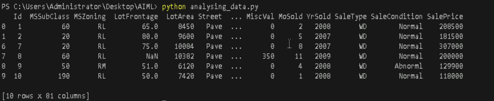

---


### **Scikit-learn-Example**

Scikit-learn is a library for machine learning. Here are two simple examples of using Scikit-learn for linear regression:

**Example 1: Linear Regression**

- **Create a new python file**
  - Create a Python file named `scikit_learn.py` and write the following code in it.
   

```python
import numpy as np
from sklearn.linear_model import LinearRegression

# Sample data
X = np.array([[1, 1], [1, 2], [2, 2], [2, 3]])
y = np.dot(X, np.array([1, 2])) + 3

# Create a linear regression model
model = LinearRegression().fit(X, y)

# Predict using the model
predictions = model.predict(np.array([[3, 5]]))
print("Predictions:", predictions)
```

**Run the Python file**
- Use the command below in your terminal to run the Python file:
 
```bash
python scikit_learn.py
```


**Output:**

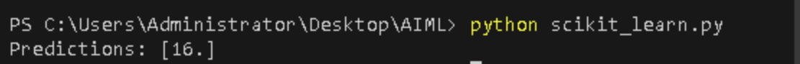

<br>

---

**Example 2: Model Coefficients**

- **Create a new python file**
  - Create a Python file named `model_coeffient.py` and write the following code in it.
   

```python
import numpy as np
from sklearn.linear_model import LinearRegression

# Sample data
X = np.array([[1, 2], [2, 3], [3, 4], [4, 5]])
y = np.dot(X, np.array([2, 1])) + 4

# Create a linear regression model
model = LinearRegression().fit(X, y)

# Display model coefficients
print("Coefficients:", model.coef_)
print("Intercept:", model.intercept_)
```

**Run the Python file**
- Use the command below in your terminal to run the Python file:
 
```bash
python model_coeffient.py
```


**Output:**

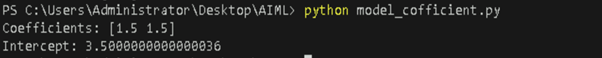

<br>

---

## **Reference**

- [NumPy Documentation](https://numpy.org/devdocs/user/absolute_beginners.html)
- [Pandas Documentation](https://www.geeksforgeeks.org/introduction-to-pandas-in-python/)
- [Scikit-learn Documentation](https://www.geeksforgeeks.org/learning-model-building-scikit-learn-python-machine-learning-library/)

---

   

