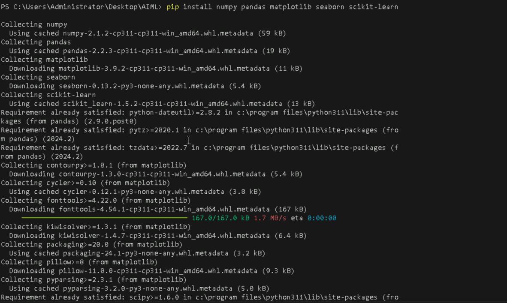
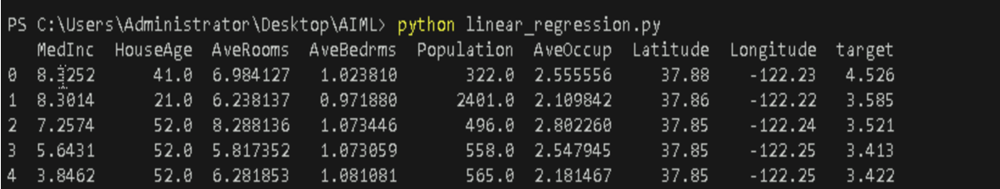
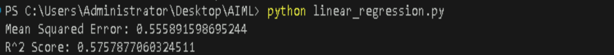

# **Implement linear regression using Scikit-learn on a sample dataset**

## **Table of Contents**

- [**Description**](#description)  
- [**Problem Statement**](#problem-statement)  
- [**Prerequisites**](#prerequisites)  
  - [**Software Required**](#software-required)  
  - [**Hardware Requirements**](#hardware-requirements)  
- [**Setup Instructions**](#setup-instructions)  
  - [**Step 1: Install Python**](#install-python)  
  - [**Step 2: Install Visual Studio Code (VSCode)**](#install-visual-studio-code-vscode)  
  - [**Step 3: Install Required Libraries**](#install-required-libraries)  
- [**Key Concepts**](#key-concepts)  
- [**Example Usage**](#example-usage)  
  - [**Loading the Dataset**](#loading-the-dataset)  
  - [**Implementing Linear Regression**](#implementing-linear-regression)  
  - [**Visualizing the Results**](#visualizing-the-results)  
    - [**True vs. Predicted Values**](#true-vs-predicted-values)  
    - [**Distribution of Target Variable**](#distribution-of-target-variable)  
    - [**Residual Plot**](#residual-plot)  
    - [**Feature Importance**](#feature-importance)  
- [**References**](#references)  


---


## **Description**

This lab guide will help you implement linear regression using Scikit-learn on the California Housing dataset. Linear regression is a basic and commonly used type of predictive analysis. The overall idea of regression is to examine two things: 

- Does a set of predictor variables do a good job in predicting an outcome (dependent) variable? 

- Which variables in particular are significant predictors of the outcome variable, and in what way do they impact the outcome variable?

---

## **Problem Statement**

You will use the California Housing dataset to predict housing prices based on various features such as the median income of residents in the area, the average number of rooms, the median house age, and more.

---

## **Prerequisites**
Completion of all previous lab guides (up to Lab Guide-01) is required before proceeding with Lab Guide-02.


### **Software Required**

- Python version 3.11.9
- Visual Studio Code (VSCode)
- Libraries: `numpy`, `pandas`, `matplotlib`, `seaborn`, `scikit-learn`


### **Hardware Requirements**

- Minimum 4GB RAM.
- At least 1GB of free disk space.
- A GPU (optional, but recommended for faster training).

---

## **Setup Instructions**

### **Setting Up a Python Environment**

**1. Install Python**

   You can download and install Python 3.11.9 from the official Python website:

   - Visit the **[official Python website](https://www.python.org/downloads/windows/)**.
   - Locate a reliable version of Python 3, **"Download Python 3.11.9"**.
   - Choose the correct link for your device from the options provided: either Windows installer (64-bit) or Windows installer (32-bit) and proceed to download the executable file. 
   

   <br>

**2. Install Visual Studio Code (VSCode)**

   Download and install VSCode from the official Visual Studio Code website:

   [Download Visual Studio Code](https://code.visualstudio.com/)
   
   <br>

**3. Install Required Libraries**

   Open a terminal or command prompt and run the following commands to install the necessary libraries:

   ```bash
   pip install numpy pandas matplotlib seaborn scikit-learn
   ```

   
   
 
   <br>

---

## **Key Concepts**

### **Linear Regression**

Linear regression is a statistical method used to model the relationship between a dependent variable (target) and one or more independent variables (features). It attempts to find the linear relationship by fitting a line through the data points.


### **Coefficients**

In linear regression, coefficients represent the relationship between each feature and the target variable. Each coefficient indicates how much the target variable is expected to change when the corresponding feature increases by one unit, holding all other features constant. A positive coefficient means that as the feature increases, the target variable tends to increase, while a negative coefficient indicates that as the feature increases, the target variable tends to decrease.


### **Mean Squared Error (MSE)**

Mean Squared Error is a metric used to measure the average of the squares of the errors—that is, the average squared difference between predicted and actual values. Lower MSE values indicate better model performance.


### **R-squared (R²)**

R-squared is a statistical measure that represents the proportion of the variance for the target variable that's explained by the independent variables in the model. An R² value closer to 1 indicates a better fit for the model.


### **Matplotlib**

Matplotlib is a Python library used for creating static, interactive, and animated visualizations in Python. It provides a wide variety of plotting functions to visualize data in various formats, making it easy to analyze and interpret results.

---

## **Example Usage**

### **Loading the Dataset**

- **Create a new python file**
  - Create a Python file named `lineary_regression.py`.
   
We will use the California Housing dataset from Scikit-learn. This dataset can be loaded as follows:

```python
from sklearn.datasets import fetch_california_housing
import pandas as pd

# Load the dataset
housing = fetch_california_housing()
data = pd.DataFrame(housing.data, columns=housing.feature_names)
data['target'] = housing.target

# Display the first few rows of the dataset
print(data.head())
```

**Run the Python file**
- Use the command below in your terminal to run the Python file:
 
```bash
python linear_regression.py
```


**Output**



---

### **Implementing Linear Regression**

We will use Scikit-learn to implement linear regression on this dataset.

```python
from sklearn.datasets import fetch_california_housing 
import pandas as pd 
from sklearn.model_selection import train_test_split 
from sklearn.linear_model import LinearRegression 
from sklearn.metrics import mean_squared_error, r2_score 

# Load the dataset 
housing = fetch_california_housing() 
data = pd.DataFrame(housing.data, columns=housing.feature_names) 
data['target'] = housing.target 


# Split the data into training and testing sets 
X = data.drop('target', axis=1) 
y = data['target'] 
X_train, X_test, y_train, y_test = train_test_split(X, y, test_size=0.2, random_state=42) 
# Create and train the model 
model = LinearRegression() 
model.fit(X_train, y_train) 
# Make predictions 
y_pred = model.predict(X_test) 
# Evaluate the model 
mse = mean_squared_error(y_test, y_pred) 
r2 = r2_score(y_test, y_pred) 
print(f"Mean Squared Error: {mse}") 
print(f"R^2 Score: {r2}") 
```

**Run the Python file**
- Use the command below in your terminal to run the Python file:
 
```bash
python linear_regression.py
```


**Output**




---

### **True vs. Predicted Values**
We can visualize the relationship between the true and predicted values and also look at the distribution of the target variable.

```python
import matplotlib.pyplot as plt
import seaborn as sns

# Plot true vs predicted values
plt.figure(figsize=(10, 6))
sns.scatterplot(x=y_test, y=y_pred)
plt.plot([y.min(), y.max()], [y.min(), y.max()], 'r--', lw=2)  # Diagonal line
plt.xlabel('True Values')
plt.ylabel('Predictions')
plt.title('True vs Predicted Values')
plt.grid()
plt.show()
```

**Run the Python file**
- Use the command below in your terminal to run the Python file:
 
```bash
python linear_regression.py
```


**Output**

.png)

---


### **Distribution of Target Variable**

```python
# Plot distribution of target variable
plt.figure(figsize=(10, 6))
sns.histplot(data['target'], bins=30, kde=True)
plt.xlabel('House Prices')
plt.title('Distribution of House Prices')
plt.grid()
plt.show()
```

**Run the Python file**
- Use the command below in your terminal to run the Python file:
 
```bash
python linear_regression.py
```


**Output**

.png)


---

### **Residual Plot**

A residual plot helps visualize the errors of the model.

```python
# Plot residuals
residuals = y_test - y_pred
plt.figure(figsize=(10, 6))
sns.scatterplot(x=y_pred, y=residuals)
plt.axhline(0, color='red', linestyle='--')
plt.xlabel('Predicted Values')
plt.ylabel('Residuals')
plt.title('Residuals vs Predicted Values')
plt.grid()
plt.show()
```

**Run the Python file**
- Use the command below in your terminal to run the Python file:
 
```bash
python linear_regression.py
```


**Output**

.png)


---


### **Feature Importance**

We can visualize the coefficients of the features to understand their importance.

```python
# Plot feature importance
plt.figure(figsize=(12, 6))
features = X.columns
importance = model.coef_
sns.barplot(x=importance, y=features)
plt.xlabel('Coefficient Value')
plt.title('Feature Importance')
plt.grid()
plt.show()
```

**Run the Python file**
- Use the command below in your terminal to run the Python file:
 
```bash
python linear_regression.py
```


**Output**

.png)


---

## **References**

- [Scikit-learn Documentation](https://scikit-learn.org/stable/)
- [California Housing Dataset](https://scikit-learn.org/stable/datasets/real_world.html#california-housing-dataset)


