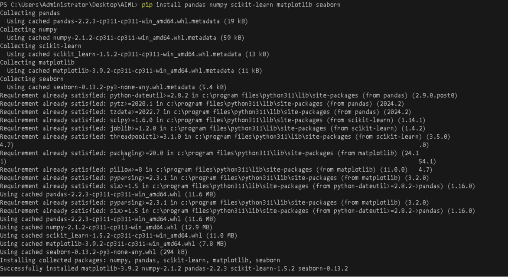
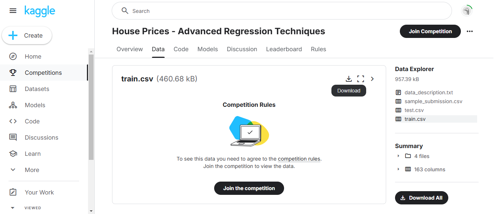
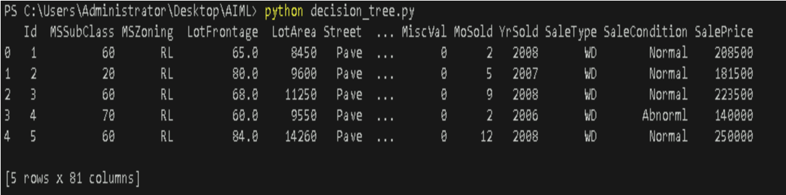
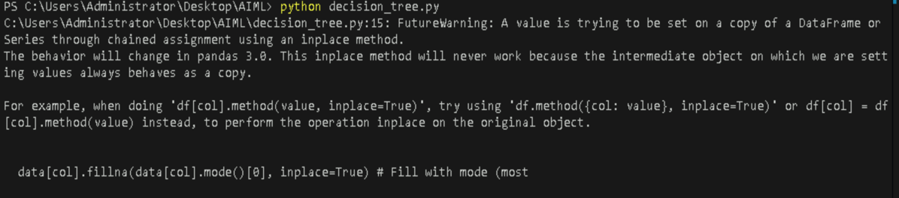
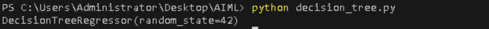
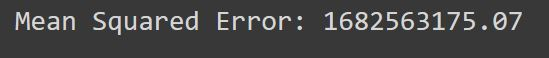
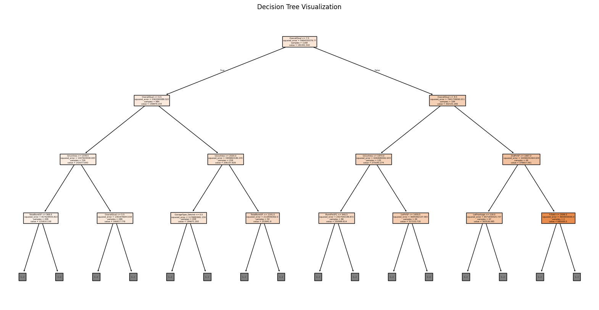
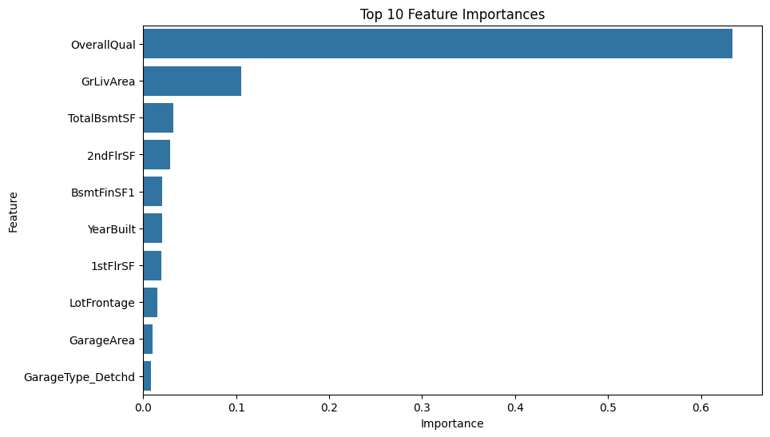

# **Building and Evaluating a Decision Tree Classifier on a real world dataset**

## **Table of Contents**

- [**Description**](#description)
- [**Problem Statement**](#problem-statement)
- [**Prerequisites**](#prerequisites)
  - [**Software Requirements**](#software-requirements)
  - [**Hardware Requirements**](#hardware-requirements)
- [**Setup Instructions**](#setup-instructions)
  - [**Setting Up a Python Environment**](#setting-up-a-python-environment)
    - [**Install Python**](#install-python)
    - [**Install Visual Studio Code**](#install-visual-studio-code)
    - [**Install Required Extensions for VSCode**](#install-required-extensions-for-vscode)
    - [**Create a Virtual Environment**](#create-a-virtual-environment)
    - [**Install Required Libraries**](#install-required-libraries)
- [**Key Terms**](#key-terms)
  - [**Decision Tree**](#decision-tree)
  - [**Regression**](#regression)
  - [**Overfitting**](#overfitting)
  - [**Feature Importance**](#feature-importance)
- [**Example Usage**](#example-usage)
  - [**Downloading the Dataset**](#downloading-the-dataset)
  - [**Loading the Dataset**](#loading-the-dataset)
  - [**Data Preprocessing**](#data-preprocessing)
  - [**Implementing the Decision Tree Classifier**](#implementing-the-decision-tree-classifier)
  - [**Evaluating the Model**](#evaluating-the-model)
  - [**Visualizing the Decision Tree**](#visualizing-the-decision-tree)
  - [**Visualizing Feature Importances**](#visualizing-feature-importances)
- [**References**](#references)


---

## **Description**

In this lab, we will explore the **House Prices dataset** from Kaggle, which contains information about various properties in Ames, Iowa, along with their sale prices. This dataset includes numerous features such as the size of the house, the number of bedrooms and bathrooms, the condition of the property, and other relevant attributes. The goal is to utilize a **Decision Tree Classifier** to predict house prices based on these features, demonstrating the application of machine learning techniques on a real-world dataset.

---

## **Problem Statement**

The objective of this lab is to develop a model that accurately predicts the sale prices of houses based on their features. By implementing a **Decision Tree Classifier**, we aim to understand how this algorithm can be employed to handle regression tasks effectively. We will train our model on a portion of the dataset and evaluate its performance on unseen data, providing insights into its accuracy and ability to generalize.

---

## **Prerequisites**
Completion of all previous lab guides (up to Lab Guide-02) is required before proceeding with Lab Guide-03.

### **Software Requirements**
- **Python Version**: Python 3.11.9
- **Integrated Development Environment**: Visual Studio Code (VSCode)
- **Required Libraries**:
  - `pandas`
  - `numpy`
  - `scikit-learn`
  - `matplotlib`
  - `seaborn`

<br>

### **Hardware Requirements**
- Minimum **4 GB RAM**
- Recommended **8 GB RAM** or more for optimal performance
- **CPU**: Intel i5 or equivalent


---

## **Setup Instructions**

### **Setting Up a Python Environment**
**1. Install Python**: Download and install Python 3.11.9 from the [**official Python website**](https://www.python.org/downloads/windows/).
   - Locate a reliable version of Python 3, **"Download Python 3.11.9"**.
   - Choose the correct link for your device from the options provided: either Windows installer (64-bit) or Windows installer (32-bit) and proceed to download the executable file. 
   


**2. Install Visual Studio Code**: Download and install VSCode from the [**official website**](https://code.visualstudio.com/).


**3. Install Required Extensions for VSCode**
   - Python extension for VSCode (search for "Python" in the Extensions Marketplace).


**4. Create a Virtual Environment**
   - Open VSCode Terminal (``Ctrl + ` ``).
   - Run the following commands to create a virtual environment:

 ```bash
 python -m venv house_price_env
 ```


   - Activate the virtual environment for Windows:
   
 ```bash
 house_price_env\Scripts\activate
 ```

    
**5. Install Required Libraries**
   - With the virtual environment activated, run:

```bash
pip install pandas numpy scikit-learn matplotlib seaborn
```




---

## **Key Terms**

- **Decision Tree**: A flowchart-like structure used for decision-making, breaking down a dataset into smaller subsets while developing an associated decision tree incrementally.


- **Regression**: A type of predictive modeling technique that estimates the relationships among variables. In this context, it is used to predict continuous outcomes (house prices).


- **Overfitting**: A modeling error that occurs when a model captures noise instead of the underlying data distribution, leading to poor performance on unseen data.


- **Feature Importance**: A technique to quantify the contribution of each feature in making predictions, helping to interpret the model's behavior.

---


## **Example Usage**

### **Downloading the Dataset**
**1. Sign in to Kaggle**: Go to the [**Kaggle website**](https://www.kaggle.com/) and sign in to your account. If you don’t have an account, create one.


**2. Download the Dataset**:
   - Navigate to the [**House Prices: Advanced Regression Techniques**](https://www.kaggle.com/c/house-prices-advanced-regression-techniques) competition page.

   

   - Click on the "Data" tab and download the `train.csv` file (the dataset used for training).
   - Move the downloaded `train.csv` file into your project directory.

---


### **Loading the Dataset**
Create a new Python file (e.g., `decision_tree.py`) in VSCode and add the following code to load the dataset:

```python
import pandas as pd

# Load the dataset
data = pd.read_csv('./train.csv')  # Adjust the path if necessary
print(data.head())
```

**Output**




---


### **Data Preprocessing**
Before training the model, we need to preprocess the dataset by handling missing values and encoding categorical variables. Add the following code for preprocessing:

```python
# Handle missing values
# Fill missing values for numeric columns with their mean
numeric_cols = data.select_dtypes(include=['float64', 'int64']).columns  # Get numeric columns
data[numeric_cols] = data[numeric_cols].fillna(data[numeric_cols].mean())  # Replace NaN with mean

# Fill missing values for categorical columns with their mode
categorical_cols = data.select_dtypes(include=['object']).columns  # Get categorical columns
for col in categorical_cols:
    data[col].fillna(data[col].mode()[0], inplace=True)  # Fill with mode (most common value)

# Convert categorical variables to dummy/indicator variables
data = pd.get_dummies(data, drop_first=True)

# Define features and target variable
X = data.drop(['SalePrice'], axis=1)  # Features
y = data['SalePrice']  # Target variable
```


**Output**



---


### **Implementing the Decision Tree Classifier**
Add the following code to implement the Decision Tree Classifier:

```python
from sklearn.model_selection import train_test_split
from sklearn.tree import DecisionTreeRegressor

# Splitting the dataset into training and testing sets
X_train, X_test, y_train, y_test = train_test_split(X, y, test_size=0.2, random_state=42)

# Creating and training the model
model = DecisionTreeRegressor(random_state=42)
model.fit(X_train, y_train)
```

**Output**




---


### **Evaluating the Model**
Add the following code to evaluate the model:

```python
from sklearn.metrics import mean_squared_error

# Making predictions
predictions = model.predict(X_test)

# Evaluating the model
mse = mean_squared_error(y_test, predictions)
print(f'Mean Squared Error: {mse:.2f}')
```

**Output**




---


### **Visualizing the Decision Tree**
To visualize the decision tree, add the following code:

```python
from sklearn.tree import plot_tree
import matplotlib.pyplot as plt

plt.figure(figsize=(20,10))
plot_tree(model, filled=True, feature_names=X.columns, max_depth=3)
plt.title('Decision Tree Visualization')
plt.show()
```

**Output**




---


### **Visualizing Feature Importances**
Finally, to visualize feature importances, add the following code:

```python
import seaborn as sns

# Getting feature importances
importances = model.feature_importances_

# Creating a DataFrame for visualization
feature_importance_df = pd.DataFrame({'Feature': X.columns, 'Importance': importances})
feature_importance_df = feature_importance_df.sort_values(by='Importance', ascending=False)

# Visualizing feature importances
plt.figure(figsize=(10,6))
sns.barplot(x='Importance', y='Feature', data=feature_importance_df.head(10))
plt.title('Top 10 Feature Importances')
plt.show()
```

**Output**




---

## **References**
- [Kaggle House Prices Dataset](https://www.kaggle.com/c/house-prices-advanced-regression-techniques)
- [Matplotlib Documentation](https://matplotlib.org/stable/users/index.html)
- [Decision Tree Classification](https://www.datacamp.com/tutorial/decision-tree-classification-python)

