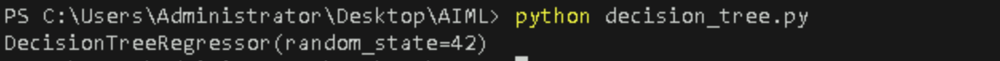
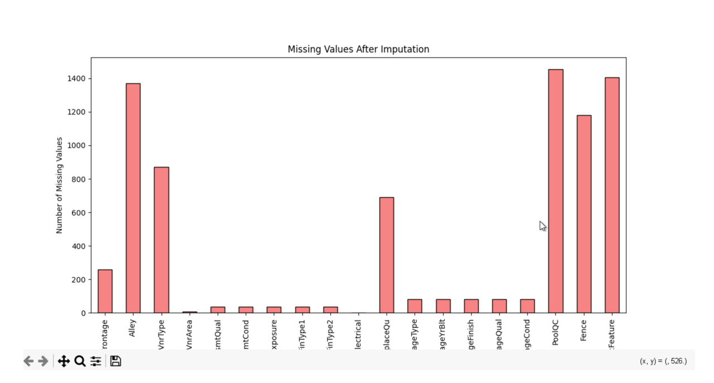
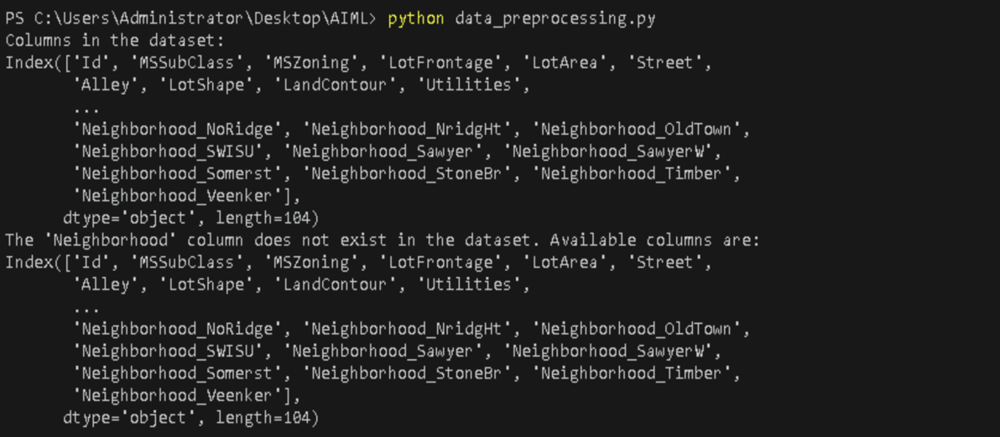

# **Perform data preprocessing tasks like normalization and encoding using Pandas**

## **Table of Contents**

- [**Description**](#description)  
- [**Problem Statement**](#problem-statement)  
- [**Objectives**](#objectives)  
- [**Prerequisites**](#prerequisites)  
  - [**Software Requirements**](#software-requirements)  
  - [**Hardware Requirements**](#hardware-requirements)  
- [**Setup Instructions**](#setup-instructions)  
  - [**Setting Up a Python Environment**](#setting-up-a-python-environment)  
- [**Key Concepts**](#key-concepts)  
  - [**Normalization**](#normalization)  
  - [**Encoding**](#encoding)  
  - [**Handling Missing Values**](#handling-missing-values)  
  - [**Exploratory Data Analysis (EDA)**](#exploratory-data-analysis-(eda))  
- [**Data Preprocessing Steps**](#data-preprocessing-steps)  
  - [**Loading the Dataset**](#loading-the-dataset)  
  - [**Exploratory Data Analysis (EDA)**](#exploratory-data-analysis-eda)  
  - [**Handling Missing Values**](#handling-missing-values)  
  - [**Visualizing Missing Values**](#visualizing-missing-values)  
  - [**Normalization**](#normalization-1)  
  - [**Encoding Categorical Variables**](#encoding-categorical-variables)  
- [**References**](#references)  


---

## **Description**

Data preprocessing is a crucial phase in the data analysis and machine learning pipeline. It involves cleaning, transforming, and organizing raw data into a structured format that is suitable for analysis or modeling. Proper preprocessing enhances data quality, reduces noise, and can significantly improve the performance of machine learning models. This lab guide focuses on using the Pandas library in Python to carry out essential preprocessing tasks, particularly normalization and encoding. 

---

## **Problem Statement**

Raw datasets often contain inconsistencies, missing values, and varying formats, making effective analysis and modeling challenging. This guide focuses on using Pandas in Python to preprocess data by handling missing values, normalizing numerical features, and encoding categorical variables. The objective is to transform the dataset into a clean, structured format that enhances data quality and improves model performance.

---

## **Prerequisites**
Completion of all previous lab guides (up to Lab Guide-03) is required before proceeding with Lab Guide-04.


### **Software Requirements**

- **Python**: Version 3.11.9
- **VSCode**: Visual Studio Code editor


### **Hardware Requirements**

- Minimum 4GB RAM.
- At least 1GB of free disk space for storing datasets.

---


## **4. Setup Instructions**

### **Setting Up a Python Environment**
**1. Install Python from [**official Python website**](https://www.python.org/downloads/windows/).**
   - Locate a reliable version of Python 3, **"Download Python 3.11.9"**.
   - Choose the correct link for your device from the options provided: either Windows installer (64-bit) or Windows installer (32-bit) and proceed to download the executable file. 
   


**2. Install required packages using pip:**

```bash
pip install pandas matplotlib scikit-learn
```


---


## **Key Concepts**

Here’s a simplified explanation of the key concepts related to data preprocessing:

### **Normalization**
Normalization scales numerical data to a specific range, usually between 0 and 1. This ensures that no single feature dominates the analysis due to larger values. For example, if you have data on house prices and square footage, normalizing helps algorithms treat both features equally. Common methods include Min-Max scaling, where each value is adjusted based on the minimum and maximum of the dataset.

<br>

### **Encoding**
Encoding converts categorical variables (like color names or city names) into numerical values so that machine learning algorithms can process them. The two main methods are:

- **One-Hot Encoding**: This creates a new binary column for each category. For instance, if you have a “Color” feature with values like "Red," "Green," and "Blue," it will create three columns: one for each color, with a 1 or 0 indicating presence.

- **Label Encoding**: This assigns an integer to each category. For instance, "Red" could be 0, "Green" 1, and "Blue" 2. This method is simpler but can introduce unintended relationships if the categories do not have a natural order.

<br>

### **Handling Missing Values**
Missing values can lead to inaccurate models. There are a few common approaches to deal with them:

- **Imputation**: Filling in missing values with statistical measures like the mean or median. For example, if you have missing age data, you might fill those gaps with the average age of the group.

- **Dropping**: If a feature has too many missing values, it might be better to remove it from the dataset entirely, or drop the rows with missing values if they are not significant.

<br>

### **Exploratory Data Analysis (EDA)**
EDA is the process of examining datasets to summarize their main characteristics, often through visualizations. It helps identify patterns, relationships, and potential outliers, guiding further preprocessing steps. For instance, you might use histograms to see how data is distributed or scatter plots to check relationships between variables.

---


## **Data Preprocessing Steps**

### **Loading the Dataset**

- **Create a new python file**
  - Create a Python file named `data_preprocessing.py`.
   
Begin by loading the dataset into a Pandas DataFrame. You can download the dataset from Kaggle:

- **Downloading the Dataset**

  - Go to the [**Kaggle website**](https://www.kaggle.com/) and sign in to your account. If you don’t have an account, create one.

  - Navigate to the [**House Prices: Advanced Regression Techniques**](https://www.kaggle.com/c/house-prices-advanced-regression-techniques) competition page.

   
   
  - Click on the "Data" tab and download the `train.csv` file (the dataset used for training).
  - Move the downloaded `train.csv` file into your project directory.


```python
import pandas as pd

# Load the dataset
data = pd.read_csv('./train.csv')
```

---


### **Exploratory Data Analysis (EDA)**
Perform exploratory data analysis to understand the dataset.

```python
# Display basic information about the dataset
print(data.info())
print(data.describe())

# Check for missing values
missing_values = data.isnull().sum()
print("Missing Values:\n", missing_values[missing_values > 0])
```


**Run the Python file**
- Use the command below in your terminal to run the Python file:
 
```bash
python data_preprocessing.py
```


**Output**



<br>


---


### **Handling Missing Values**
Address missing values appropriately, as they can significantly impact model performance.

- **Methods to handle missing values:**
  - **Mean/Median Imputation:** Replace missing values with the mean or median of the column.
  - **Mode Imputation:** For categorical variables, use the mode.
  - **Dropping Missing Values:** If the percentage of missing data is significant, consider dropping the column or row.


```python
# Fill missing values (example: mean imputation for LotFrontage)
data['LotFrontage'].fillna(data['LotFrontage'].mean(), inplace=True)

# For categorical features, fill with mode
data['MasVnrType'].fillna(data['MasVnrType'].mode()[0], inplace=True)
```


**Run the Python file**
- Use the command below in your terminal to run the Python file:
 
```bash
python data_preprocessing.py
```


**Output**


---


### **Visualizing Missing Values**

```python
import matplotlib.pyplot as plt

# Create a bar plot for missing values before handling
plt.figure(figsize=(10, 6))
missing_values[missing_values > 0].plot(kind='bar', color='skyblue', edgecolor='black')
plt.title('Missing Values by Feature')
plt.xlabel('Features')
plt.ylabel('Number of Missing Values')
plt.show()

# Recheck missing values after imputation
missing_values_after = data.isnull().sum()
plt.figure(figsize=(10, 6))
missing_values_after[missing_values_after > 0].plot(kind='bar', color='lightcoral', edgecolor='black')
plt.title('Missing Values After Imputation')
plt.xlabel('Features')
plt.ylabel('Number of Missing Values')
plt.show()
```


**Run the Python file**
- Use the command below in your terminal to run the Python file:
 
```bash
python data_preprocessing.py
```


**Output**



---


### **Normalization**
Normalize numerical features to a common scale.

```python
from sklearn.preprocessing import MinMaxScaler

# Normalize numerical features
scaler = MinMaxScaler()
data[['LotFrontage']] = scaler.fit_transform(data[['LotFrontage']])
```

---


**Visualizing Normalized Features:**

```python
# Plotting before and after normalization
plt.figure(figsize=(12, 6))
plt.subplot(1, 2, 1)
plt.hist(data['LotFrontage'], bins=30, color='skyblue', edgecolor='black')
plt.title('LotFrontage Distribution (Before Normalization)')
plt.xlabel('LotFrontage')
plt.ylabel('Frequency')

plt.subplot(1, 2, 2)
plt.hist(data['LotFrontage'], bins=30, color='lightgreen', edgecolor='black')
plt.title('LotFrontage Distribution (After Normalization)')
plt.xlabel('LotFrontage')
plt.ylabel('Frequency')

plt.tight_layout()
plt.show()

```


**Run the Python file**
- Use the command below in your terminal to run the Python file:
 
```bash
python data_preprocessing.py
```


**Output**


---


### **Encoding Categorical Variables**
Transform categorical variables into a numerical format using encoding techniques.

```python
# Encoding categorical variables
data = pd.get_dummies(data, columns=['Neighborhood'], drop_first=True)
```

---


**Visualizing Encoded Features:**

```python
# Check the column names
print("Columns in the dataset:")
print(data.columns)

# Strip whitespace from headers (if needed)
data.columns = data.columns.str.strip()

# Check if 'Neighborhood' column exists
if 'Neighborhood' in data.columns:
    # Visualizing the distribution of the 'Neighborhood' feature
    plt.figure(figsize=(10, 6))
    data['Neighborhood'].value_counts().plot(kind='bar', color='salmon', edgecolor='black')
    plt.title('Distribution of Neighborhoods')
    plt.xlabel('Neighborhood')
    plt.ylabel('Count')
    plt.xticks(rotation=45)
    plt.show()
else:
    print("The 'Neighborhood' column does not exist in the dataset. Available columns are:")
    print(data.columns)
```


**Run the Python file**
- Use the command below in your terminal to run the Python file:
 
```bash
python data_preprocessing.py
```


**Output**




---


## **References**

- Download the dataset: [Kaggle House Prices: Advanced Regression Techniques](https://www.kaggle.com/c/house-prices-advanced-regression-techniques/data) 

- [Data Preprocessing in Python](https://serokell.io/blog/data-preprocessing-in-python)


