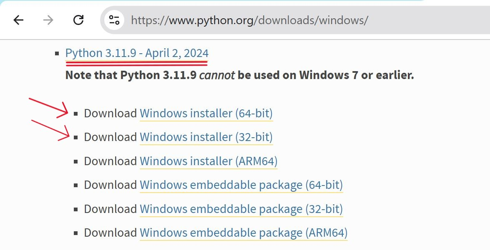
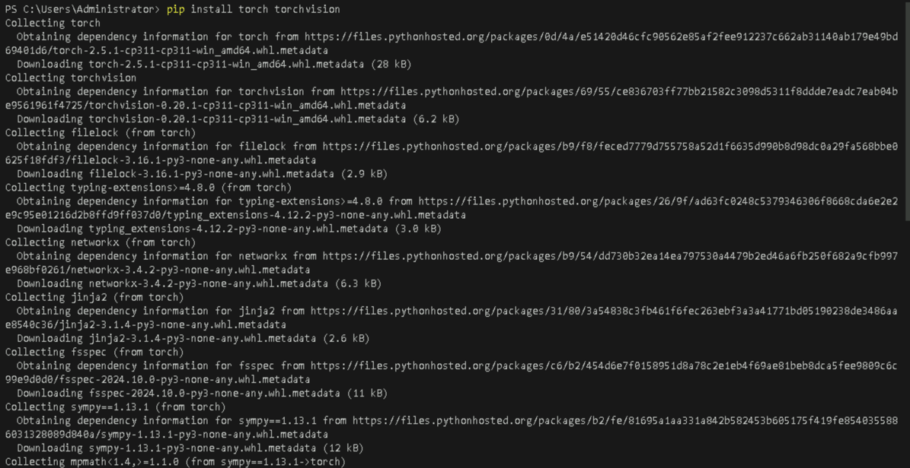
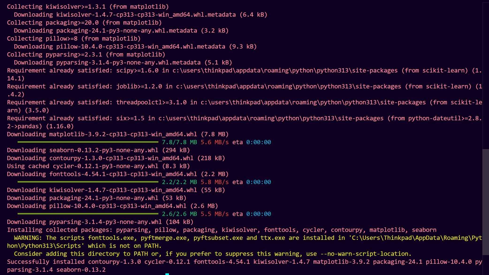
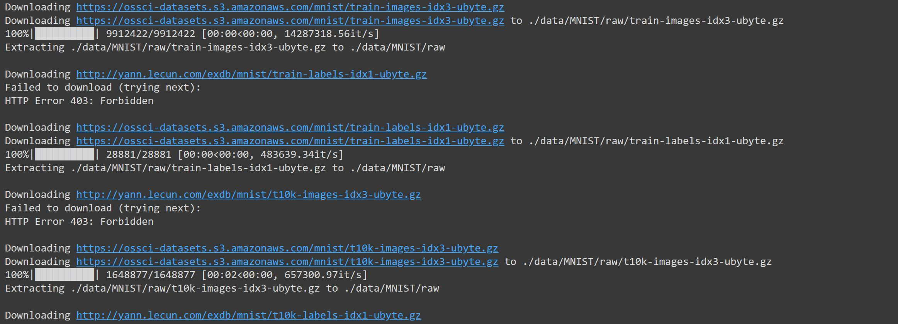
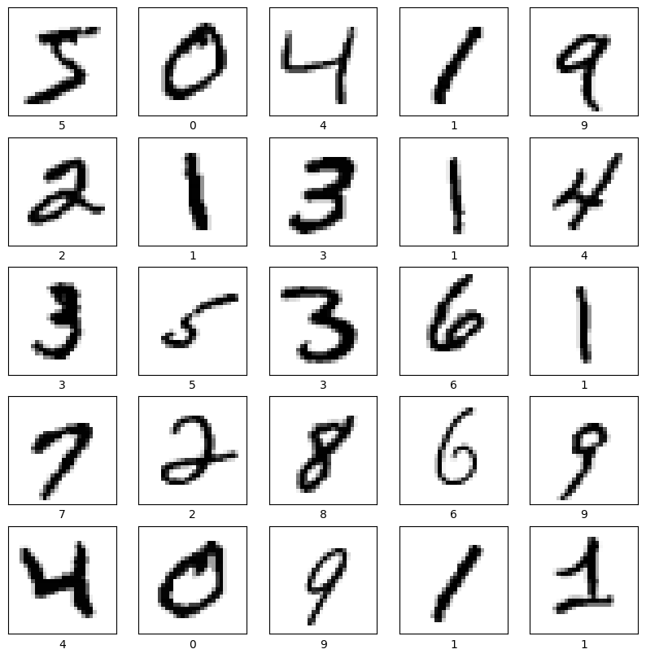
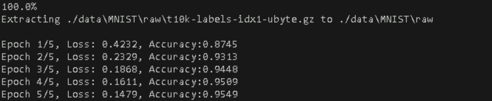
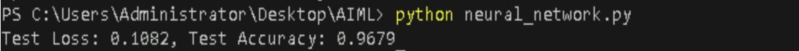
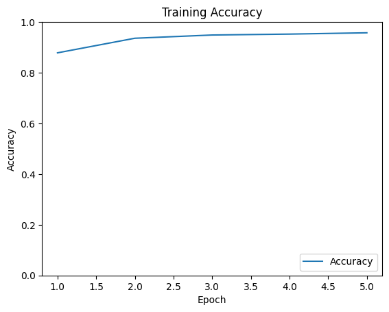
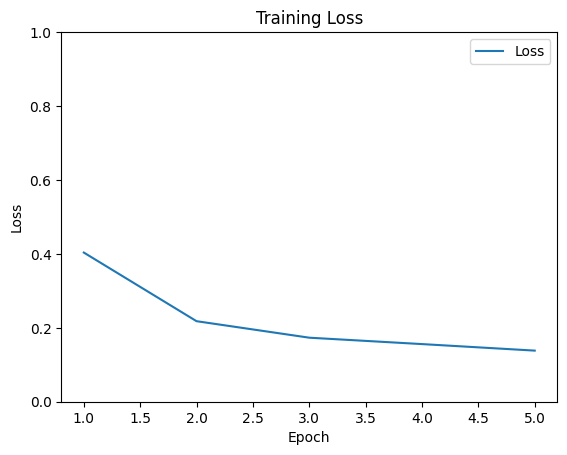

# **Create and Train a Simple Neural Network using PyTorch**

## **Table of Contents**

- [**Description**](#description)  
- [**Problem Statement**](#problem-statement)  
- [**Prerequisites**](#prerequisites)  
  - [**Software Requirements**](#software-requirements)  
  - [**Hardware Requirements**](#hardware-requirements)  
- [**Setup Instructions**](#setup-instructions)  
  - [**Setting Up a Python Environment**](#setting-up-a-python-environment)  
    - [**Install Python**](#install-python)
    - [**Create a Virtual Environment**](#create-a-virtual-environment)
    - [**Install Required Packages**](#install-required-packages)
- [**Key Concepts**](#key-concepts)  
  - [**Neural Networks**](#neural-networks)  
  - [**PyTorch**](#pytorch)  
- [**Steps to Create and Train a Neural Network**](#steps-to-create-and-train-a-neural-network)  
  - [**Loading and Preparing Data**](#loading-and-preparing-data)  
  - [**Building the Neural Network**](#building-the-neural-network)  
  - [**Compiling the Model**](#compiling-the-model)  
  - [**Training the Model**](#training-the-model)  
  - [**Evaluating the Model**](#evaluating-the-model)  
  - [**Visualizing Training Results**](#visualizing-training-results)  
- [**Optional TensorFlow Implementation**](#optional-tensorflow-implementation)  
- [**References**](#references)  


---

## **Description**
In this lab, you will learn how to create and train a simple neural network using PyTorch, a popular deep learning framework. You will work with the MNIST dataset, a collection of handwritten digits, to build a model that can recognize digits from 0 to 9.

---

## **Problem Statement**
The goal is to build a neural network that can accurately classify handwritten digits from the MNIST dataset. The MNIST dataset contains 60,000 training images and 10,000 testing images of handwritten digits, labeled from 0 to 9. You will preprocess the data, build a neural network model, train it, evaluate its performance, and visualize the training process.

---

## **Prerequisites**
Completion of all previous lab guides (up to Lab Guide-04) is required before proceeding with Lab Guide-05.


### **Software Requirements**
- **Python**: Version 3.11.9
- **PyTorch**: Install using `pip install torch torchvision`.
- **Tensorflow**: Install using `pip install tensorflow`.
- **Visual Studio Code (VSCode)**: A lightweight code editor that provides powerful features for Python development, including extensions for linting, debugging, and version control.
- **NumPy**: Install using `pip install numpy`.
- **Matplotlib**: Install using `pip install matplotlib`.


### **Hardware Requirements**
- Minimum 4GB RAM.
- At least 1GB of free disk space.
- A GPU (optional, but recommended for faster training).

---


## **Setup Instructions**

### **Setting Up a Python Environment**
**1. Install Python**: You can download and install Python 3.11.9 from the official Python website:

   - Visit the [official Python website](https://www.python.org/downloads/windows/).
   - Locate a reliable version of Python 3, **"Download Python 3.11.9"**.
   - Choose the correct link for your device from the options provided: either Windows installer (64-bit) or Windows installer (32-bit) and proceed to download the executable file. 

   


---

**2. Create a Virtual Environment**:

   ```bash
   python -m venv myenv
   source myenv/bin/activate  # On Windows use `myenv\Scripts\activate`
   ```

---


**3. Install Required Packages**:

   ```bash
   pip install torch torchvision
   ```

   


   ```bash
   pip install matplotlib, numpy
   ```
   
   
   
---


## **Key Concepts**

### **Neural Networks**

Neural networks are computational models designed to simulate the way the human brain processes information. These networks consist of layers of nodes, also called neurons, which are interconnected. Each connection has a weight that adjusts as learning proceeds, guiding the strength of the signal from one neuron to another. The primary components of neural networks are:

1. **Input Layer**: The layer that receives the initial data.
2. **Hidden Layers**: Layers between the input and output layers where computation is performed through weighted connections. These layers can be numerous and form the depth of the network.
3. **Output Layer**: The layer that produces the final result or prediction.

Neural networks are used for various tasks such as image and speech recognition, natural language processing, and game playing. They excel at identifying patterns and making predictions based on data.

<br>

### **TensorFlow**

TensorFlow is an open-source deep learning framework developed by the Google Brain team. It provides a comprehensive ecosystem for building and deploying machine learning models. TensorFlow is widely used in industry and research for tasks such as image and speech recognition, natural language processing, and reinforcement learning.

<br>

### **PyTorch**

PyTorch is an open-source deep learning framework developed by Facebook's AI Research lab. It is known for its flexibility and ease of use, particularly due to its dynamic computation graph. PyTorch is particularly favored in the research community due to its flexibility and ease of use, making it suitable for prototyping and experimenting with new ideas.

---


## **Steps to Create and Train a Neural Network**

### **Loading and Preparing Data**
**1. Import Libraries**:
   ```python
   import torch
   import torch.nn as nn
   import torch.optim as optim
   from torchvision import datasets, transforms
   import numpy as np
   import matplotlib.pyplot as plt
   ```

---


**2. Load and Normalize Data**:
   ```python
   transform = transforms.Compose([
       transforms.ToTensor(),
       transforms.Normalize((0.5,), (0.5,))  # Normalize to [-1, 1]
   ])

   train_dataset = datasets.MNIST(root='./data', train=True, download=True, transform=transform)
   test_dataset = datasets.MNIST(root='./data', train=False, download=True, transform=transform)

   train_loader = torch.utils.data.DataLoader(dataset=train_dataset, batch_size=64, shuffle=True)
   test_loader = torch.utils.data.DataLoader(dataset=test_dataset, batch_size=64, shuffle=False)
   ```

   **Output**

   


---

**3. Visualize Sample Data**:
   ```python
   plt.figure(figsize=(10, 10))
   for i in range(25):
       plt.subplot(5, 5, i+1)
       plt.xticks([])
       plt.yticks([])
       plt.grid(False)
       image, label = train_dataset[i]
       plt.imshow(image.squeeze(), cmap=plt.cm.binary)
       plt.xlabel(label)
   plt.show()
   ```

   **Output**

   


---


### **Building the Neural Network**
**Define the Model**:
   ```python
   class SimpleNN(nn.Module):
       def __init__(self):
           super(SimpleNN, self).__init__()
           self.flatten = nn.Flatten()
           self.fc1 = nn.Linear(28 * 28, 128)
           self.relu = nn.ReLU()
           self.dropout = nn.Dropout(0.2)
           self.fc2 = nn.Linear(128, 10)

       def forward(self, x):
           x = self.flatten(x)
           x = self.fc1(x)
           x = self.relu(x)
           x = self.dropout(x)
           x = self.fc2(x)
           return x

   model = SimpleNN()
   ```

---


### **Compiling the Model**
**Define the Loss Function and Optimizer**:
   ```python
   criterion = nn.CrossEntropyLoss()
   optimizer = optim.Adam(model.parameters())
   ```

---


### **Training the Model**
**Train the Model**:
   ```python
   epochs = 5
   train_losses, train_accuracies = [], []

   for epoch in range(epochs):
       model.train()
       running_loss = 0.0
       correct = 0
       total = 0

       for images, labels in train_loader:
           optimizer.zero_grad()
           outputs = model(images)
           loss = criterion(outputs, labels)
           loss.backward()
           optimizer.step()

           running_loss += loss.item()
           _, predicted = torch.max(outputs.data, 1)
           total += labels.size(0)
           correct += (predicted == labels).sum().item()

       epoch_loss = running_loss / len(train_loader)
       accuracy = correct / total
       train_losses.append(epoch_loss)
       train_accuracies.append(accuracy)
       print(f'Epoch {epoch+1}/{epochs}, Loss: {epoch_loss:.4f}, Accuracy: {accuracy:.4f}')
   ```


   **Output**

   

---


### **Evaluating the Model**
**Evaluate the Model**:
   ```python
   model.eval()
   test_loss = 0.0
   correct = 0
   total = 0

   with torch.no_grad():
       for images, labels in test_loader:
           outputs = model(images)
           loss = criterion(outputs, labels)
           test_loss += loss.item()
           _, predicted = torch.max(outputs.data, 1)
           total += labels.size(0)
           correct += (predicted == labels).sum().item()

   test_loss /= len(test_loader)
   test_accuracy = correct / total
   print(f'Test Loss: {test_loss:.4f}, Test Accuracy: {test_accuracy:.4f}')
   ```

   **Output**

   

---


### **Visualizing Training Results**
**Plot Training Accuracy**:
   ```python
   plt.plot(range(1, epochs + 1), train_accuracies, label='Accuracy')
   plt.xlabel('Epoch')
   plt.ylabel('Accuracy')
   plt.ylim([0, 1])
   plt.legend(loc='lower right')
   plt.title('Training Accuracy')
   plt.show()
   ```

   **Output**

   


---


**Plot Training Loss**:
   ```python
   plt.plot(range(1, epochs + 1), train_losses, label='Loss')
   plt.xlabel('Epoch')
   plt.ylabel('Loss')
   plt.ylim([0, 1])
   plt.legend(loc='upper right')
   plt.title('Training Loss')
   plt.show()
   ```

   **Output**

   


---


## **Optional TensorFlow Implementation**

If you prefer to use TensorFlow instead of PyTorch, you can follow similar steps to build and train a neural network for the MNIST dataset. Here's a quick guide to implementing the same neural network using TensorFlow:


### **Installing TensorFlow via pip**

   **Install TensorFlow**:
   ```sh
   pip install tensorflow
   ```

---

### **Complete Code**

```python
import tensorflow as tf
from tensorflow.keras.datasets import mnist
from tensorflow.keras.models import Sequential
from tensorflow.keras.layers import Flatten, Dense, Dropout
import matplotlib.pyplot as plt

# Load and normalize the MNIST dataset
(x_train, y_train), (x_test, y_test) = mnist.load_data()
x_train, x_test = x_train / 255.0, x_test / 255.0

# Visualize sample data
plt.figure(figsize=(10, 10))
for i in range(25):
    plt.subplot(5, 5, i+1)
    plt.xticks([])
    plt.yticks([])
    plt.grid(False)
    plt.imshow(x_train[i], cmap=plt.cm.binary)
    plt.xlabel(y_train[i])
plt.show()

# Define the model
model = Sequential([
    Flatten(input_shape=(28, 28)),
    Dense(128, activation='relu'),
    Dropout(0.2),
    Dense(10, activation='softmax')
])

# Compile the model
model.compile(optimizer='adam',
              loss='sparse_categorical_crossentropy',
              metrics=['accuracy'])

# Train the model
history = model.fit(x_train, y_train, epochs=5, validation_data=(x_test, y_test))

# Evaluate the model
test_loss, test_acc = model.evaluate(x_test, y_test, verbose=2)
print(f'Test accuracy: {test_acc}')

# Visualize training history
plt.plot(history.history['accuracy'], label='accuracy')
plt.plot(history.history['val_accuracy'], label='val_accuracy')
plt.xlabel('Epoch')
plt.ylabel('Accuracy')
plt.ylim([0, 1])
plt.legend(loc='lower right')
plt.show()
```

---


## **References**

- [Introduction to PyTorch](https://pytorch.org/tutorials/beginner/deep_learning_60min_blitz.html)
- [Tensorflow vs. PyTorch](https://www.simplilearn.com/keras-vs-tensorflow-vs-pytorch-article)
