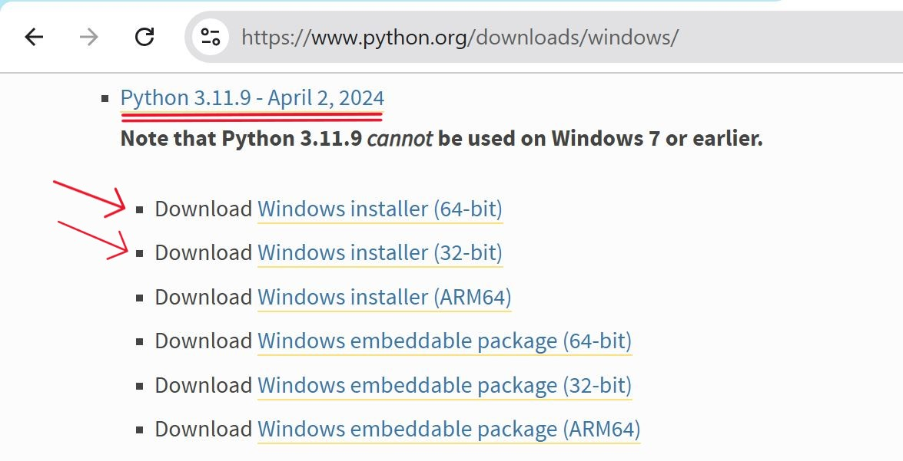

# **Use K-means clustering to segment a dataset into different groups**

## **Table of Contents**

- [**Description**](#description)
- [**Problem Statement**](#problem-statement)
- [**Prerequisites**](#prerequisites)
  - [**Software Requirements**](#software-requirements)
  - [**Hardware Requirements**](#hardware-requirements)
- [**Setup Instructions**](#setup-instructions)
  - [**Downloading the Dataset**](#downloading-the-dataset)
  - [**Installing Required Libraries**](#installing-required-libraries)
  - [**Setting Up the Environment**](#setting-up-the-environment)
    - [**Install Python**](#install-python)
    - [**Install Visual Studio Code (VSCode)**](#install-visual-studio-code-vscode)
- [**Using K-means Clustering**](#using-k-means-clustering)
  - [**Data Preprocessing**](#data-preprocessing)
  - [**Applying K-means Clustering**](#applying-k-means-clustering)
  - [**Evaluating Clustering Performance**](#evaluating-clustering-performance)
  - [**Visualizing Results**](#visualizing-results)
- [**References**](#references)

---

## **Description**

K-means clustering is an unsupervised machine learning algorithm that partitions data into **K** distinct groups based on feature similarities. In this lab, we will apply K-means clustering to a house prices dataset to uncover different price segments and analyze their characteristics.

---

## **Problem Statement**

The goal of this lab is to segment the house prices dataset into different clusters to identify patterns and characteristics of properties in various price ranges. Understanding these segments can assist stakeholders in making informed decisions regarding pricing, marketing, and investment strategies.

---

## **Prerequisites**
Completion of all previous lab guides (up to Lab Guide-05) is required before proceeding with Lab Guide-06.


### **Software Requirements**
- **Python** : Python version 3.11.9
- **Visual Studio Code (VSCode)**: A lightweight code editor that provides powerful features for Python development, including extensions for linting, debugging, and version control.


### **Hardware Requirements**
- A computer with at least **4 GB of RAM**.
- At least 1GB of free disk space.
- A GPU (optional, but recommended for faster training).

---


## **Setup Instructions**

### **Downloading the Dataset**
**1. Sign in to Kaggle**: Go to the [**Kaggle website**](https://www.kaggle.com/) and sign in to your account. If you don’t have an account, create one.


**2. Download the Dataset**:
   - Navigate to the [**House Prices: Advanced Regression Techniques**](https://www.kaggle.com/c/house-prices-advanced-regression-techniques) competition page.

   
   
   - Click on the "Data" tab and download the `train.csv` file (the dataset used for training).
   - Move the downloaded `train.csv` file into your project directory.

---


### **Installing Required Libraries**
You can install the required libraries using pip. Run the following command in your terminal or command prompt:

```bash
pip install pandas numpy matplotlib seaborn scikit-learn
```


---

### **Setting Up the Environment**

**1. Install Python:**

   You can download and install Python 3.11.9 from the official Python website:

   - Visit the [**official Python website**](https://www.python.org/downloads/windows/).
   - Locate a reliable version of Python 3, **"Download Python 3.11.9"**.
   - Choose the correct link for your device from the options provided: either Windows installer (64-bit) or Windows installer (32-bit) and proceed to download the executable file. 
   

   <br>

**2. Install Visual Studio Code (VSCode):**

   Download and install VSCode from the official Visual Studio Code website:

   [**Download Visual Studio Code**](https://code.visualstudio.com/)
   
   <br>

---

## **Using K-means Clustering**

**K-means Clustering**
K-means clustering is an unsupervised machine learning algorithm used to partition a dataset into K distinct groups (clusters) based on feature similarities. The algorithm works by randomly initializing K cluster centroids and iteratively refining them to minimize the distance between data points and their assigned centroids.


- **Create a new python file**
  - Create a Python file named `Kmeans_clustering.py` and write following code in it.
   

### **Data Preprocessing**

- [**Import Libraries**](#import-libraries)
- [**Load the Dataset**](#load-the-dataset)
- [**Explore the Dataset**](#explore-the-dataset)
- [**Check for Non-Numeric Entries**](#check-for-non-numeric-entries)
- [**Convert Columns to Numeric**](#convert-columns-to-numeric)
- [**Fill Missing Values**](#fill-missing-values)

---

#### **Import Libraries**
```python
import pandas as pd
import numpy as np
import matplotlib.pyplot as plt
import seaborn as sns
from sklearn.cluster import KMeans
from sklearn.preprocessing import StandardScaler
```

---


#### **Load the Dataset**
```python
df = pd.read_csv('./train.csv')
```

---


#### **Explore the Dataset**
```python
print("Head of the dataset:")
print(df.head())
print("\nData types:")
print(df.dtypes)
```

**Run the Python file**
- Use the command below in your terminal to run the Python file:
 
```bash
python Kmeans_clustering.py
```

**Output**


---

#### **Check for Non-Numeric Entries**
```python
numeric_columns = ['LotArea', 'OverallQual', 'OverallCond', 'YearBuilt', 'SalePrice']
print("\nChecking for non-numeric entries:")
non_numeric_found = False  # Flag to check if any non-numeric entries were found

for column in numeric_columns:
    non_numeric_entries = df[~df[column].apply(lambda x: isinstance(x, (int, float)))][column]
    if not non_numeric_entries.empty:
        print(f"Non-numeric entries found in {column}:")
        print(non_numeric_entries)
        non_numeric_found = True

if not non_numeric_found:
    print("No non-numeric entries found in the specified columns.")

```

**Run the Python file**
- Use the command below in your terminal to run the Python file:
 
```bash
python Kmeans_clustering.py
```

**Output**


---

#### **Convert Columns to Numeric**
```python
for column in numeric_columns:
    df[column] = pd.to_numeric(df[column], errors='coerce')

print("\nChecking for NaN values after conversion:")
print(df[numeric_columns].isnull().sum())
```

**Run the Python file**
- Use the command below in your terminal to run the Python file:
 
```bash
python Kmeans_clustering.py
```

**Output**


---


#### **Fill Missing Values**
```python
df[numeric_columns] = df[numeric_columns].fillna(df[numeric_columns].mean())
```

---

### **Applying K-means Clustering**

- [**Feature Selection**](#feature-selection)
- [**Standardize the Data**](#standardize-the-data)
- [**Determine Optimal Number of Clusters (Elbow Method)**](#determine-optimal-number-of-clusters-elbow-method)
- [**Fit K-means Model with Optimal k**](#fit-k-means-model-with-optimal-k)

---

#### **Feature Selection**
```python
features = df[numeric_columns]
print("\nFeatures DataFrame shape:")
print(features.shape)
```

**Run the Python file**
- Use the command below in your terminal to run the Python file:

```bash
python Kmeans_clustering.py
```


**Output**


---


#### **Standardize the Data**

- **Standardization**: A preprocessing step to scale features to have a mean of zero and a standard deviation of one.

```python
scaler = StandardScaler()
features_scaled = scaler.fit_transform(features)
```

---

#### **Determine Optimal Number of Clusters (Elbow Method)**

- **Elbow Method**: A technique to determine the optimal number of clusters by plotting the inertia against the number of clusters.

```python
inertia = []
K = range(1, 11)  # Testing for k from 1 to 10

for k in K:
    kmeans = KMeans(n_clusters=k, random_state=0)
    kmeans.fit(features_scaled)
    inertia.append(kmeans.inertia_)

plt.plot(K, inertia, 'bx-')
plt.xlabel('Number of clusters')
plt.ylabel('Inertia')
plt.title('Elbow Method For Optimal k')
plt.grid()
plt.show()
```

**Run the Python file**
- Use the command below in your terminal to run the Python file:
 
```bash
python Kmeans_clustering.py
```


**Output**


#### **Fit K-means Model with Optimal k**
```python
optimal_k = 3  # Replace with the optimal k from the Elbow Method
kmeans = KMeans(n_clusters=optimal_k, random_state=0)
kmeans.fit(features_scaled)

df['Cluster'] = kmeans.labels_
```

---

### **Evaluating Clustering Performance**

**Analyze Cluster Characteristics**
```python
try:
    cluster_analysis = df.groupby('Cluster')[numeric_columns].mean()
    print("\nCluster Analysis:")
    print(cluster_analysis)
except Exception as e:
    print("Error in cluster analysis:", e)
```

**Run the Python file**
- Use the command below in your terminal to run the Python file:

```bash
python Kmeans_clustering.py
``` 

**Output**


---


### **Visualizing Results**

**Visualize Clusters**
```python
plt.figure(figsize=(10, 6))
plt.scatter(df['LotArea'], df['SalePrice'], c=df['Cluster'], cmap='viridis', alpha=0.5)
plt.xlabel('Lot Area')
plt.ylabel('Sale Price')
plt.title('K-means Clustering of House Prices')
plt.colorbar(label='Cluster')
plt.grid()
plt.show()
```

**Output**


---


**Visualize Cluster Centers**
```python
centers = scaler.inverse_transform(kmeans.cluster_centers_)
plt.scatter(centers[:, 0], centers[:, 4], c='red', marker='X', s=200, label='Centroids')
plt.xlabel('Lot Area')
plt.ylabel('Sale Price')
plt.title('Cluster Centers')
plt.legend()
plt.grid()
plt.show()
```

**Output**


---

## **References**
- [K-means Clustering Documentation - Scikit-learn](https://www.geeksforgeeks.org/k-means-clustering-introduction/)
- [StandardScaler Documentation - Scikit-learn](https://scikit-learn.org/stable/modules/generated/sklearn.preprocessing.StandardScaler.html)
- [Matplotlib Documentation](https://matplotlib.org/stable/contents.html)

