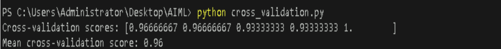
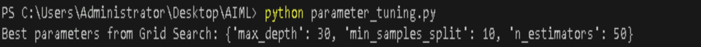
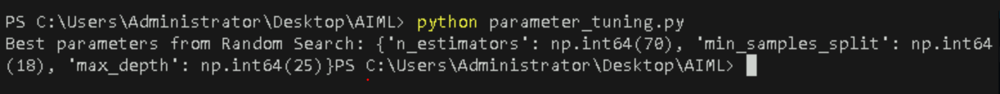
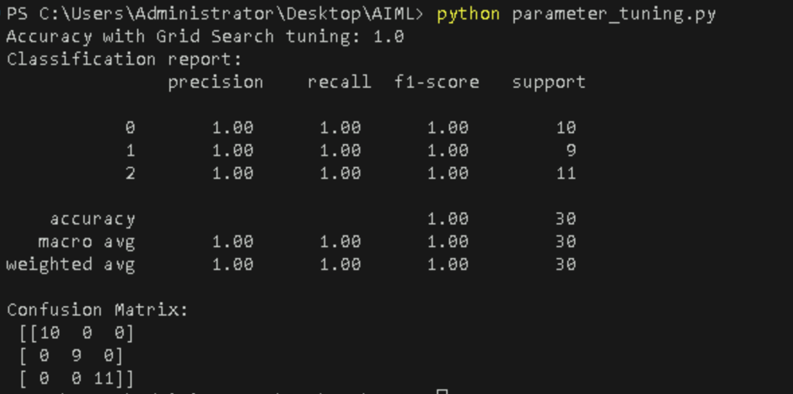
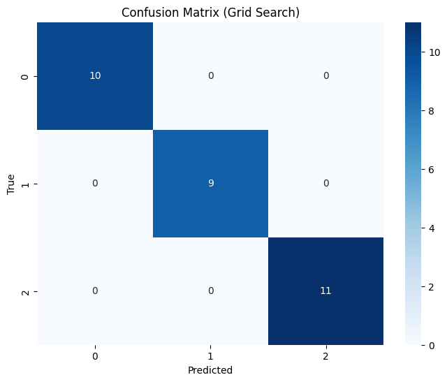

# **Implementing Cross-Validation and Hyperparameter Tuning for a Machine Learning Model**


## **Table of Contents**

- [**Description**](#description)
- [**Problem Statement**](#problem-statement)
- [**Prerequisites**](#prerequisites)
  - [**Software Requirements**](#software-requirements)
  - [**Hardware Requirements**](#hardware-requirements)
- [**Setup Instructions**](#setup-instructions)
  - [**Downloading the Dataset**](#downloading-the-dataset)
  - [**Installing Required Libraries**](#installing-required-libraries)
  - [**Setting Up the Environment**](#setting-up-the-environment)
    - [**Install Python**](#install-python)
    - [**Install Visual Studio Code (VSCode)**](#install-visual-studio-code-vscode)
- [**Implement Cross-Validation and Hyperparameter Tuning for a Machine Learning Model**](#implement-cross-validation-and-hyperparameter-tuning-for-a-machine-learning-model)
  - [**Understanding Cross-Validation**](#understanding-cross-validation)
  - [**Understanding Hyperparameter Tuning**](#understanding-hyperparameter-tuning)
  - [**Model Selection**](#model-selection)
  - [**Implementing Cross-Validation**](#implementing-cross-validation)
  - [**Hyperparameter Tuning**](#hyperparameter-tuning)
  - [**Model Evaluation**](#model-evaluation)
  - [**Visualizing Results**](#visualizing-results)
- [**Conclusion**](#conclusion)
- [**References**](#references)


---

## **Description**
This lab guide provides a step-by-step approach to implementing cross-validation and hyperparameter tuning using a Random Forest classifier on the Iris dataset. You'll learn how to enhance your model's performance by selecting the best parameters and validating the results.

---

## **Problem Statement**
In machine learning, building a model with high accuracy is often challenging. This lab aims to demonstrate how cross-validation and hyperparameter tuning can significantly improve model performance and reliability.

---

## **Prerequisites**
Completion of all previous lab guides (up to Lab Guide-06) is required before proceeding with Lab Guide-07.


### **Software Requirements**
- **Python**: Python 3.11.9
- **Visual Studio Code (VSCode)**: A lightweight code editor that provides powerful features for Python development, including extensions for linting, debugging, and version control.
- **Libraries**: `NumPy`, `Pandas`, `Matplotlib`, `Seaborn`, `Scikit-learn`


### **Hardware Requirements**
- Minimum 4GB RAM.
- At least 1GB of free disk space.
- A GPU (optional, but recommended for faster training).

---

## **Setup Instructions**

- **Downloading the Dataset**:For this lab, we will use the Iris dataset, which is included in the Scikit-learn library. If you want to use another dataset, ensure it's in CSV format and accessible in your working directory.


- **Installing Required Libraries**: Make sure you have the necessary libraries installed. You can install them using pip:

```bash
pip install numpy pandas matplotlib seaborn scikit-learn
```


---


### **Setting Up the Environment**

**1. Install Python:**

   You can download and install Python 3.11.9 from the official Python website:

   - Visit the [**official Python website**](https://www.python.org/downloads/windows/).
   - Locate a reliable version of Python 3, **"Download Python 3.11.9"**.
   - Choose the correct link for your device from the options provided: either Windows installer (64-bit) or Windows installer (32-bit) and proceed to download the executable file. 
   

   <br>

**2. Install Visual Studio Code (VSCode):**

   Download and install VSCode from the official Visual Studio Code website:

   [**Download Visual Studio Code**](https://code.visualstudio.com/)
   
   <br>

---

## **Implement Cross-Validation and Hyperparameter Tuning for a Machine Learning Model**

### **Understanding Cross-Validation**
Cross-validation is a technique used to evaluate the performance of a machine learning model by splitting the data into training and testing sets multiple times. It helps in assessing how the results of a statistical analysis will generalize to an independent data set.


### **Understanding Hyperparameter Tuning**
Hyperparameters are the parameters that are set before the learning process begins. Tuning these parameters can lead to better model performance. The two main methods for tuning are Grid Search and Random Search.


### **Model Selection**
Choosing the right model is critical. For this lab, we will use the Random Forest classifier due to its robustness and versatility in handling classification tasks.


---

### **Implementing Cross-Validation**

- [**Creating the Python File**](#creating-the-python-file)
- [**Importing Libraries**](#importing-libraries)
- [**Loading Dataset and Splitting the Data**](#loading-dataset-and-splitting-the-data)
- [**Implementing Cross-Validation**](#implementing-cross-validation-1)

---

### **Create a new python file**
  - Create a Python file named `cross_validation.py`.

---

### **Importing Libraries**
Use the following code to implement cross-validation with the Iris dataset:

```python
import numpy as np
import pandas as pd
from sklearn.datasets import load_iris
from sklearn.model_selection import train_test_split, cross_val_score
from sklearn.ensemble import RandomForestClassifier
```

---

### **Load Dataset Splitting the data into training and testing sets**
```python
data = load_iris()
X = data.data
y = data.target

X_train, X_test, y_train, y_test = train_test_split(X, y, test_size=0.2, random_state=42) #splitting the dataset into train and test
```

---

### **Implementing Cross-Validation**

```python
model = RandomForestClassifier()
scores = cross_val_score(model, X, y, cv=5)
print("Cross-validation scores:", scores)
print("Mean cross-validation score:", np.mean(scores))
```

**Run the Python file**
- Use the command below in your terminal to run the Python file:
 
```bash
python cross_validation.py
```


**Output**



---

### **Hyperparameter Tuning**

- [**Grid Search**](#grid-search)
- [**Random Search**](#random-search)

---

#### **Create a new python file**
  - Create a Python file named `parameter_tuning.py` and write following code in it.

---

#### **Grid Search**
To find the best hyperparameters using Grid Search:

```python
import numpy as np
import pandas as pd
from sklearn.datasets import load_iris
from sklearn.model_selection import train_test_split, cross_val_score
from sklearn.ensemble import RandomForestClassifier
from sklearn.model_selection import GridSearchCV

data = load_iris()
X = data.data
y = data.target

X_train, X_test, y_train, y_test = train_test_split(X, y, test_size=0.2, random_state=42) #splitting the dataset 
model = RandomForestClassifier()
scores = cross_val_score(model, X, y, cv=5)

# Hyperparameter tuning using Grid Search
param_grid = {
    'n_estimators': [50, 100, 150],
    'max_depth': [None, 10, 20, 30],
    'min_samples_split': [2, 5, 10]
}

grid_search = GridSearchCV(estimator=model, param_grid=param_grid, cv=5, scoring='accuracy')
grid_search.fit(X_train, y_train)

# Best parameters from Grid Search
print("Best parameters from Grid Search:", grid_search.best_params_)
```

**Run the Python file**
- Use the command below in your terminal to run the Python file:
 
```bash
python parameter_tuning.py
```


**Output**



---


#### **Random Search**
You can also perform hyperparameter tuning using Random Search:

```python

import numpy as np 
import pandas as pd 
from sklearn.datasets import load_iris 
from sklearn.model_selection import train_test_split,cross_val_score 
from sklearn.model_selection import RandomizedSearchCV
from sklearn.ensemble import RandomForestClassifier 
data = load_iris() 
X = data.data 
y = data.target 
#splitting the dataset into train and test
X_train, X_test, y_train, y_test = train_test_split(X, y, test_size=0.2, random_state=42)

# Hyperparameter tuning using Random Search
random_param_dist = {
    'n_estimators': np.arange(50, 200, 10),
    'max_depth': [None] + list(np.arange(10, 30, 5)),
    'min_samples_split': np.arange(2, 20, 2)
}

random_search = RandomizedSearchCV(estimator=model, param_distributions=random_param_dist,n_iter=100, cv=5, scoring='accuracy', random_state=42)
random_search.fit(X_train, y_train)

# Best parameters from Random Search
print("Best parameters from Random Search:", random_search.best_params_)
```

**Run the Python file**
- Use the command below in your terminal to run the Python file:
 
```bash
python parameter_tuning.py
```


**Output**



---

### **Model Evaluation**
After hyperparameter tuning, evaluate your model using accuracy scores and confusion matrices:

```python
from sklearn.metrics import accuracy_score, confusion_matrix, classification_report

# Evaluate the model with best parameters
best_model = grid_search.best_estimator_
y_pred = best_model.predict(X_test)

print("Accuracy with Grid Search tuning:", accuracy_score(y_test, y_pred))
print("Classification report:\n", classification_report(y_test, y_pred))
print("Confusion Matrix:\n", confusion_matrix(y_test, y_pred))
```


**Run the Python file**
- Use the command below in your terminal to run the Python file:
 
```bash
python parameter_tuning.py
```


**Output**



---

### **Visualizing Results**
Visualize the confusion matrix to better understand your model’s performance:

```python
import matplotlib.pyplot as plt
import seaborn as sns

plt.figure(figsize=(8, 6))
sns.heatmap(confusion_matrix(y_test, y_pred), annot=True, fmt='d', cmap='Blues')
plt.title('Confusion Matrix (Grid Search)')
plt.xlabel('Predicted')
plt.ylabel('True')
plt.show()
```


**Run the Python file**
- Use the command below in your terminal to run the Python file:
 
```bash
python parameter_tuning.py
```


**Output**


---


### Visualizing the Confusion Matrix for the best model from Random Search
```python
import matplotlib.pyplot as plt
import seaborn as sns
plt.figure(figsize=(8, 6))
sns.heatmap(confusion_matrix(y_test, y_pred), annot=True, fmt='d', cmap='Blues')
plt.title('Confusion Matrix (Random Search)')
plt.xlabel('Predicted')
plt.ylabel('True')
plt.show()
```


**Run the Python file**
- Use the command below in your terminal to run the Python file:
 
```bash
python parameter_tuning.py
```


**Output**


---

## **References**
- [Scikit-learn documentation](https://scikit-learn.org/)
- [Cross Validation and Hyperparameter Tuning](https://medium.com/almabetter/cross-validation-and-hyperparameter-tuning-91626c757428)
- [Grid Search](https://scikit-learn.org/stable/modules/grid_search.html)
- [Randomized Search](https://scikit-learn.org/stable/auto_examples/model_selection/plot_randomized_search.html)