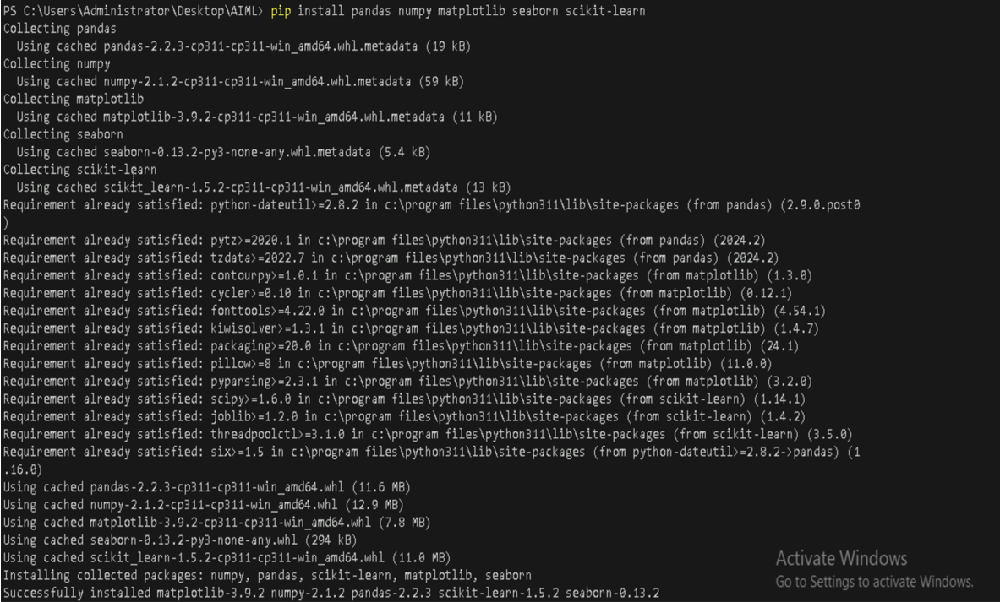

# **Visualizing Data Distributions and Model Results using Matplotlib and Seaborn**

## **Table of Contents**

- [**Description**](#description)
- [**Problem Statement**](#problem-statement)
- [**Prerequisites**](#prerequisites)
  - [**Software Required**](#software-required)
  - [**Hardware Requirements**](#hardware-requirements)
- [**Setup Instructions**](#setup-instructions)
  - [**Step 1: Install Python and Required Libraries**](#step-1-install-python-and-required-libraries)
  - [**Step 2: Install Matplotlib and Seaborn**](#step-2-install-matplotlib-and-seaborn)
  - [**Step 3: Verify Library Installation**](#step-3-verify-library-installation)
- [**Visualizing Data with Matplotlib**](#visualizing-data-with-matplotlib)
  - [**Plotting Simple Graphs**](#plotting-simple-graphs)
  - [**Customizing Plots**](#customizing-plots)
  - [**Visualizing Data Distributions**](#visualizing-data-distributions)
- [**Visualizing Data with Seaborn**](#visualizing-data-with-seaborn)
  - [**Plotting with Seaborn**](#plotting-with-seaborn)
  - [**Customizing Seaborn Plots**](#customizing-seaborn-plots)
  - [**Seaborn Distribution Plots**](#seaborn-distribution-plots)
- [**Model Results Visualization**](#model-results-visualization)
  - [**Visualizing Model Performance Metrics**](#visualizing-model-performance-metrics)
  - [**Plotting Confusion Matrix**](#plotting-confusion-matrix)
  - [**Plotting ROC Curve**](#plotting-roc-curve)
- [**Reference**](#reference)


---

## **Description**

This lab guide provides a detailed approach to visualizing data distributions and model results using **Matplotlib** and **Seaborn**, two popular Python libraries for creating graphs and visualizations. These tools are essential for gaining insights from data and evaluating machine learning model performance.

---

## **Problem Statement**

Data visualization is a key component of data analysis and machine learning model evaluation. This guide helps users learn how to visualize data distributions and model results effectively using Matplotlib and Seaborn, which are crucial for understanding trends, patterns, and model performance.

---

## **Prerequisites**
Completion of all previous lab guides (up to Lab Guide-07) is required before proceeding with Lab Guide-08.


### **Software Required**
- **Python**: Python 3.11.9
- **Visual Studio Code (VSCode)**: A lightweight code editor that provides powerful features for Python development, including extensions for linting, debugging, and version control.
- **Libraries**: `NumPy`, `Pandas`, `Matplotlib`, `Seaborn`, `Scikit-learn`


### **Hardware Requirements**
- Minimum 4GB RAM.
- At least 1GB of free disk space.
- A GPU (optional, but recommended for faster training).

---

## **Setup Instructions**

### **Step 1: Install Python and VSCode**
**Install Python:**

   You can download and install Python 3.11.9 from the official Python website:

   - Visit the [**official Python website**](https://www.python.org/downloads/windows/).
   - Locate a reliable version of Python 3, **"Download Python 3.11.9"**.
   - Choose the correct link for your device from the options provided: either Windows installer (64-bit) or Windows installer (32-bit) and proceed to download the executable file. 
   

   <br>

**Install Visual Studio Code (VSCode):**

   Download and install VSCode from the official Visual Studio Code website:
   [**Download Visual Studio Code**](https://code.visualstudio.com/)
   
   <br>

---

### **Step 2: Install Matplotlib and Seaborn**
1. Open `Terminal` in VSCode.
2. Install the necessary libraries using `pip`.


#### **Using pip** 
   ```bash
   pip install matplotlib
   ```




   ```bash
   pip install seaborn
   ```


---


### **Step 3: Verify Library Installation**

   ```python
   import matplotlib.pyplot as plt
   import seaborn as sns
   ```

If there are no error messages, the libraries have been successfully installed.

---


## **Visualizing Data with Matplotlib**

- Create a folder called `Matplotlib` in your `VScode`.
- Create a new file
  - Create a Python file named `data_visualization.py` inside your `Matplotlib` folder and add the
 following code.

### **Plotting Simple Graphs**
Create a basic line plot using `Matplotlib`:
```python
import matplotlib.pyplot as plt

x = [1, 2, 3, 4, 5]
y = [10, 20, 25, 30, 35]

plt.plot(x, y)
plt.title('Simple Line Plot')
plt.xlabel('X-axis')
plt.ylabel('Y-axis')
plt.show()
```

**Run the Python file**
- Use the command below in your terminal to run the Python file:
 
```bash
cd Matplotlib
python data_visulization.py
```


**Output**


---


### **Customizing Plots**
Customize plot elements like color, style, and labels:
```python
plt.plot(x, y, color='green', linestyle='--', marker='o')
plt.title('Customized Line Plot')
plt.xlabel('X-axis')
plt.ylabel('Y-axis')
plt.grid(True)
plt.show()
```


**Run the Python file**
- Use the command below in your terminal to run the Python file:
 
```bash
python data_visulization.py
```


**Output**


---


### **Visualizing Data Distributions**
Use histograms to visualize the distribution of data:
```python
data = [1, 1, 2, 3, 5, 8, 13, 21, 34, 55]
plt.hist(data, bins=5, color='blue', edgecolor='black')
plt.title('Data Distribution')
plt.show()
```


**Run the Python file**
- Use the command below in your terminal to run the Python file:
 
```bash
python data_visulization.py
```


**Output**


---


## **Visualizing Data with Seaborn**


- Create a folder called `Seaborn` in your `VScode`.
- Create a new file
  - Create a Python file named `data_visualization.py` inside your `Seaborn` folder and add the
 following code.

### **Plotting with Seaborn**
Create a simple scatter plot using Seaborn:
```python
import seaborn as sns
import matplotlib.pyplot as plt

# Load sample dataset
data = sns.load_dataset('iris')

sns.scatterplot(x='sepal_length', y='sepal_width', data=data)
plt.title('Sepal Length vs Sepal Width')
plt.show()
```

**Run the Python file**
- Use the command below in your terminal to run the Python file:
 
```bash
cd Seaborn
python data_visulization.py
```


**Output**


---


### **Customizing Seaborn Plots**
Seaborn provides high-level commands to easily customize plots:
```python
sns.set(style='whitegrid')
sns.scatterplot(x='sepal_length', y='sepal_width', hue='species', data=data)
plt.title('Scatter Plot by Species')
plt.show()
```

**Run the Python file**
- Use the command below in your terminal to run the Python file:
 
```bash
python data_visulization.py
```


**Output**


---


### **Seaborn Distribution Plots**
Create distribution plots for visualizing univariate distributions:
```python
sns.histplot(data['sepal_length'], kde=True, color='purple')
plt.title('Sepal Length Distribution with KDE')
plt.show()
```


**Run the Python file**
- Use the command below in your terminal to run the Python file:
 
```bash
python data_visulization.py
```


**Output**


---


## **Model Results Visualization**
- Create a new file
  - Create a Python file named `data_visualization.py` inside your `Matplotlib` folder and add the
 following code.

### **Visualizing Model Performance Metrics**
Visualize model evaluation metrics like accuracy or loss over time:
```python
import matplotlib.pyplot as plt
epochs = range(1, 11)
accuracy = [0.65, 0.72, 0.75, 0.78, 0.80, 0.82, 0.83, 0.85, 0.86, 0.87]

plt.plot(epochs, accuracy, marker='o', linestyle='-', color='b')
plt.title('Model Accuracy over Epochs')
plt.xlabel('Epochs')
plt.ylabel('Accuracy')
plt.show()
```

**Run the Python file**
- Use the command below in your terminal to run the Python file:
 
```bash
python data_visulization.py
```


**Output**


---


### **Plotting Confusion Matrix**
Confusion matrix visualization helps evaluate classification performance:
```python
from sklearn.metrics import confusion_matrix
import seaborn as sns
import matplotlib.pyplot as plt
# Example confusion matrix data
cm = confusion_matrix([1, 1, 0, 0], [1, 0, 1, 0])

sns.heatmap(cm, annot=True, fmt='d', cmap='Blues')
plt.title('Confusion Matrix')
plt.xlabel('Predicted')
plt.ylabel('True')
plt.show()
```

**Run the Python file**
- Use the command below in your terminal to run the Python file:
 
```bash
python data_visulization.py
```


**Output**


---


### **Plotting ROC Curve**
Visualize the Receiver Operating Characteristic (ROC) curve:
```python
from sklearn.metrics import roc_curve
from sklearn.metrics import confusion_matrix
import seaborn as sns
import matplotlib.pyplot as plt

# Example model predictions
fpr, tpr, thresholds = roc_curve([1, 1, 0, 0], [0.9, 0.8, 0.4, 0.2])

plt.plot(fpr, tpr, color='darkorange')
plt.plot([0, 1], [0, 1], color='navy', linestyle='--')
plt.title('ROC Curve')
plt.xlabel('False Positive Rate')
plt.ylabel('True Positive Rate')
plt.show()
```


**Run the Python file**
- Use the command below in your terminal to run the Python file:
 
```bash
python data_visulization.py
```


**Output**


---


## **Reference**
- [Matplotlib Documentation](https://matplotlib.org/stable/contents.html)
- [Seaborn Documentation](https://seaborn.pydata.org/)
- [Scikit-learn Metrics](https://scikit-learn.org/stable/modules/model_evaluation.html)


