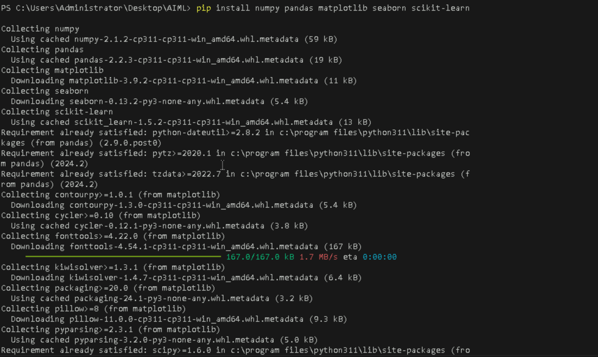

# **Training a Support Vector Machine (SVM) Model and Evaluating Its Performance**

## **Table of Contents**

- [**Description**](#description)
- [**Problem Statement**](#problem-statement)
- [**Prerequisites**](#prerequisites)
  - [**Software Required**](#software-required)
  - [**Hardware Requirements**](#hardware-requirements)
- [**Setup Instructions**](#setup-instructions)
  - [**Step 1: Install Python and Required Libraries**](#step-1-install-python-and-required-libraries)
    - [**Install Python**](#install-python)
    - [**Install Visual Studio Code (VSCode)**](#install-visual-studio-code-vscode)
    - [**Install Required Libraries**](#install-required-libraries)
- [**Support Vector Machine (SVM) Overview**](#support-vector-machine-svm-overview)
  - [**What is SVM?**](#what-is-svm)
  - [**Applications of SVM**](#applications-of-svm)
- [**Training an SVM Model**](#training-an-svm-model)
  - [**Step 1: Load and Preprocess the Dataset**](#step-1-load-and-preprocess-the-dataset)
  - [**Step 2: Split the Dataset into Training and Test Sets**](#step-2-split-the-dataset-into-training-and-test-sets)
  - [**Step 3: Train the SVM Model**](#step-3-train-the-svm-model)
- [**Evaluating Model Performance**](#evaluating-model-performance)
  - [**Accuracy, Precision, Recall, and F1-score**](#accuracy-precision-recall-and-f1-score)
  - [**Confusion Matrix**](#confusion-matrix)
  - [**ROC Curve and AUC**](#roc-curve-and-auc)
- [**References**](#references)


---

## **Description**

This lab guide demonstrates how to train a Support Vector Machine (SVM) model and evaluate its performance using popular evaluation metrics such as accuracy, precision, recall, F1-score, confusion matrix, and ROC curve. SVM is a widely used supervised learning algorithm that works well for classification tasks.

---

## **Problem Statement**

The objective of this lab is to guide you through the steps needed to train and evaluate an SVM model using Scikit-learn. By the end of this guide, you will be able to train an SVM model on a dataset, make predictions, and assess its performance.

---

## **Prerequisites**
Completion of all previous lab guides (up to Lab Guide-08) is required before proceeding with Lab Guide-09.


### **Software Required**
- **Python**: Python 3.11.9
- **Visual Studio Code (VSCode)**: A lightweight code editor that provides powerful features for Python development, including extensions for linting, debugging, and version control.
- **Libraries**: `NumPy`, `Pandas`, `Matplotlib`, `Seaborn`, `Scikit-learn`


### **Hardware Requirements**
- Minimum 4GB RAM.
- At least 1GB of free disk space.
- A GPU (optional, but recommended for faster training).

---

## **Setup Instructions**

### **Step 1: Install Python and Required Libraries**

**Install Python:**
   - Download and install Python 3.11.9 from the [**official Python website**](https://www.python.org/downloads/windows/).


**Install Visual Studio Code (VSCode):**
   - Download and install VSCode from the [**official Visual Studio Code website**](https://code.visualstudio.com/).


**Install Required Libraries:**
   - Open a terminal and run the following command to install Scikit-learn and other libraries:
   
```bash
pip install numpy pandas matplotlib seaborn scikit-learn
```



---

## **Support Vector Machine (SVM) Overview**

### **What is SVM?**

SVM is a powerful supervised learning algorithm used for classification tasks. It works by finding the optimal hyperplane that best separates the classes in a dataset. SVM can handle both linear and non-linear classification tasks.

### **Applications of SVM**
- Text Classification
- Image Recognition
- Bioinformatics
- Handwriting Recognition

---

## **Training an SVM Model**

- **Create a new python file**
  - Create a Python file named `SVM.py` and add the following code.

### **Step 1: Load and Preprocess the Dataset**

For this example, we will use the **Iris dataset**, which is readily available in Scikit-learn.

```python
from sklearn import datasets
from sklearn.preprocessing import StandardScaler

# Load the Iris dataset and standardize its features.
iris = datasets.load_iris()
X = iris.data  # Features
y = iris.target  # Target labels

# Standardize the features
scaler = StandardScaler()
X_scaled = scaler.fit_transform(X)
```


### **Step 2: Split the Dataset into Training and Test Sets**

We will split the dataset into training (80%) and test (20%) sets.

```python
from sklearn.model_selection import train_test_split

# Split the dataset into training and test sets.
X_train, X_test, y_train, y_test = train_test_split(X_scaled, y, test_size=0.2, random_state=42)
```


### **Step 3: Train the SVM Model**

Now, we will train the SVM model using a linear kernel.

```python
from sklearn.svm import SVC

# Initialize and train the SVM model with a linear kernel.
svm_model = SVC(kernel='linear', probability=True)
svm_model.fit(X_train, y_train)
print(svm_model)
```

**Run the Python file**
- Use the command below in your terminal to run the Python file:
 
```bash
python SVM.py
```


**Output**


---

## **Evaluating Model Performance**

### **Accuracy, Precision, Recall, and F1-score**

We will evaluate the model performance using key classification metrics.

```python
from sklearn.metrics import accuracy_score, precision_score, recall_score, f1_score

# Make predictions
y_pred = svm_model.predict(X_test)

# Calculate and print accuracy, precision, recall, and F1-score.
accuracy = accuracy_score(y_test, y_pred)
precision = precision_score(y_test, y_pred, average='macro')
recall = recall_score(y_test, y_pred, average='macro')
f1 = f1_score(y_test, y_pred, average='macro')

print(f'Accuracy: {accuracy:.2f}')
print(f'Precision: {precision:.2f}')
print(f'Recall: {recall:.2f}')
print(f'F1 Score: {f1:.2f}')
```


**Run the Python file**
- Use the command below in your terminal to run the Python file:
 
```bash
python SVM.py
```


**Output**


### **Confusion Matrix**

A confusion matrix provides insights into how well the model is performing in terms of correct and incorrect predictions.

```python
from sklearn.metrics import confusion_matrix
import seaborn as sns
import matplotlib.pyplot as plt

# Generate and plot the confusion matrix.
cm = confusion_matrix(y_test, y_pred)
plt.figure(figsize=(6, 4))
sns.heatmap(cm, annot=True, fmt='d', cmap='Blues')
plt.title('Confusion Matrix')
plt.xlabel('Predicted')
plt.ylabel('True')
plt.show()
```


**Run the Python file**
- Use the command below in your terminal to run the Python file:
 
```bash
python SVM.py
```


**Output**


### **ROC Curve and AUC**

Although ROC curves are typically used for binary classification, we can apply it to one of the classes in the Iris dataset to visualize the performance.

```python
from sklearn.metrics import roc_curve, auc
from sklearn.preprocessing import label_binarize
import numpy as np

# Binarize the output (for class 1 vs rest binary classification)
y_test_binarized = label_binarize(y_test, classes=[0, 1, 2])
n_classes = y_test_binarized.shape[1]

# Decision function gives decision scores for each class
y_score = svm_model.decision_function(X_test)

# Compute ROC curve and ROC area for each class
fpr = dict()
tpr = dict()
roc_auc = dict()

for i in range(n_classes):
    fpr[i], tpr[i], _ = roc_curve(y_test_binarized[:, i], y_score[:, i])
    roc_auc[i] = auc(fpr[i], tpr[i])

# Plot ROC curve for each class
plt.figure(figsize=(8, 6))
colors = ['blue', 'red', 'green']
for i, color in zip(range(n_classes), colors):
    plt.plot(fpr[i], tpr[i], color=color, lw=2,
             label=f'ROC curve of class {i} (area = {roc_auc[i]:0.2f})')

plt.plot([0, 1], [0, 1], color='navy', linestyle='--')
plt.xlim([0.0, 1.0])
plt.ylim([0.0, 1.05])
plt.title('Receiver Operating Characteristic (ROC) - Multi-Class')
plt.xlabel('False Positive Rate')
plt.ylabel('True Positive Rate')
plt.legend(loc="lower right")
plt.show()
```


**Run the Python file**
- Use the command below in your terminal to run the Python file:
 
```bash
python SVM.py
```


**Output**


---

## **References**

- [Scikit-learn Documentation](https://scikit-learn.org/stable/)
- [Understanding SVMs](https://scikit-learn.org/1.5/modules/svm.html)
