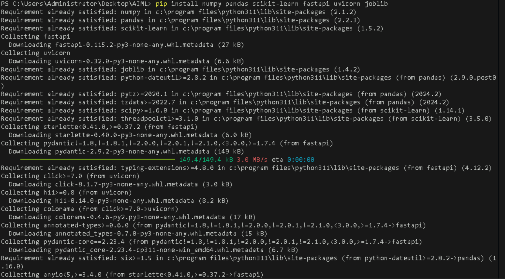
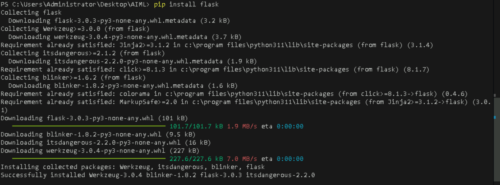
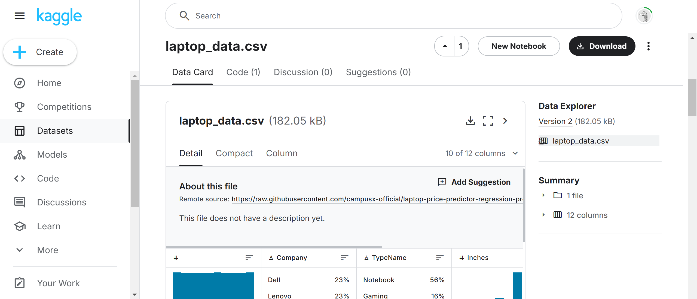
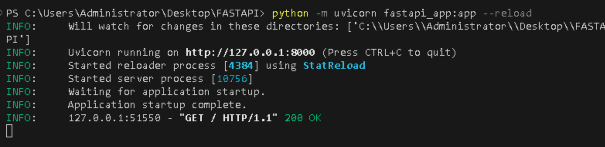
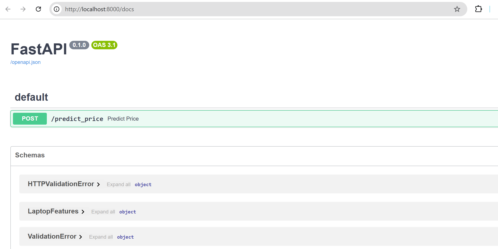
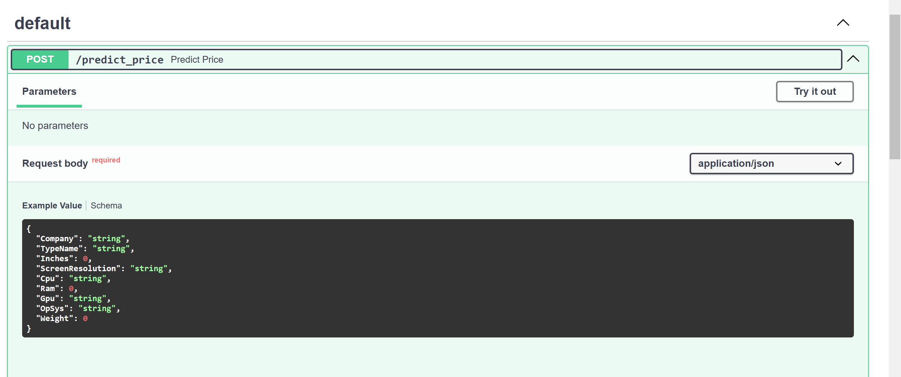
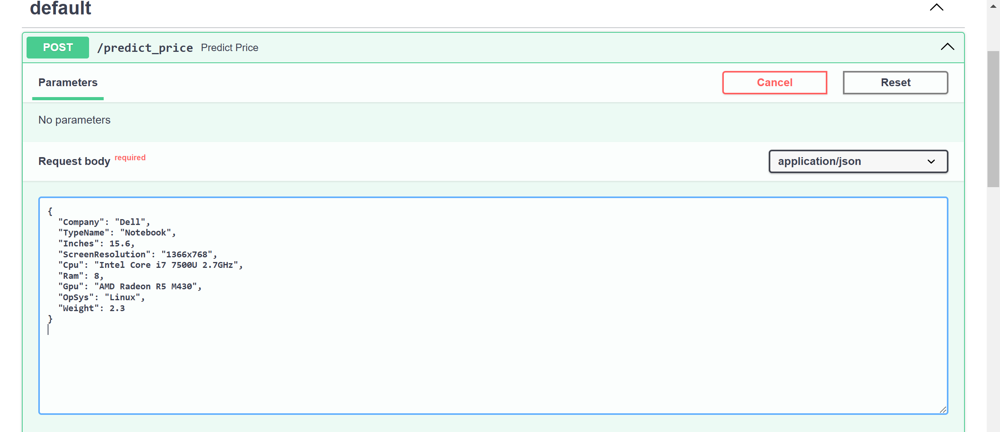
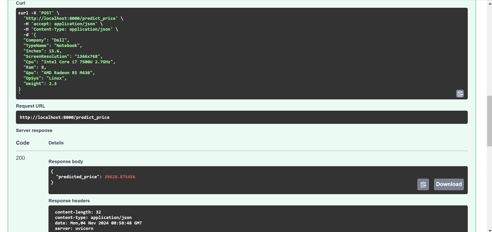

# **Deploy a Trained Machine Learning Model as a REST API Using Flask or FastAPI**


## **Table of Contents**
- [**Description**](#description)
- [**Problem Statement**](#problem-statement)
- [**Prerequisites**](#prerequisites)
  - [**Software Required**](#software-required)
  - [**Hardware Requirements**](#hardware-requirements)
- [**Setup Instructions**](#setup-instructions)
  - [**Step 1: Install Python and Required Libraries**](#step-1-install-python-and-required-libraries)
  - [**Step 2: Verify Library Installation**](#step-2-verify-library-installation)
- [**Model Training**](#model-training)
- [**Deploying the Model**](#deploying-the-model)
  - [**Using FastAPI**](#using-fastapi)
- [**Testing the API**](#testing-the-api)
  - [**Using Swagger UI**](#using-swagger-ui)
- [**Here are a few key points about joblib**](#here-are-a-few-key-points-about-joblib)
- [**Reference**](#reference)

---

## **Description**
This guide provides instructions for setting up a FastAPI-based application that predicts laptop prices based on various features. The model is trained using a Random Forest Regressor, and the trained model along with necessary label encoders are saved for deployment.

---

## **Problem Statement**
As the laptop market expands, consumers struggle to determine fair prices based on specifications, as prices can vary widely among similar models. This project aims to develop a predictive model that estimates laptop prices using key features such as brand, type, screen size, processor, RAM, GPU, operating system, and weight. By leveraging machine learning, we can provide a reliable tool to help users make informed purchasing decisions.

---

## **Prerequisites**
Completion of all previous lab guides (up to Lab Guide-09) is required before proceeding with Lab Guide-10.


### **Software Required**
- **Python**: Ensure Python 3.11.9 is installed on your system.
- **Visual Studio Code (VSCode)**: A code editor to write and manage your Python scripts.
- **Postman or cURL**: Tools for testing the API requests.
<br>

### **Hardware Requirements**
- **Minimum System Requirements**:
  - CPU: Intel Core i3 or equivalent
  - RAM: 4 GB (8 GB recommended)
  - Disk Space: 1 GB for Python and libraries

---

## **Setup Instructions**

**Install Python:**

- You can download and install Python 3.11.9 from the official Python website:

   - Visit the [**official Python website**](https://www.python.org/downloads/windows/).
   - Locate a reliable version of Python 3, **"Download Python 3.11.9"**.
   - Choose the correct link for your device from the options provided: either Windows installer (64-bit) or Windows installer (32-bit) and proceed to download the executable file.

   

   <br>

**Install Visual Studio Code (VSCode):**

  - Download and install VSCode from the official Visual Studio Code website:
    [**Download Visual Studio Code**](https://code.visualstudio.com/)
   
   <br>

**Install the necessary libraries using `pip`**
- **Create a new folder**
  - Create a folder named `Fastapi` and open that folder in your `VScode`


```bash
pip install numpy pandas scikit-learn flask fastapi uvicorn joblib
```





---


### **Step 2: Verify Library Installation**

Run the following commands in a Python environment to check if the libraries are installed correctly:

```python
import numpy
import pandas
import sklearn
import flask
import fastapi
```

If no errors are raised, the libraries are installed correctly.

---

## **Model Training** 

- **Create a new file**
  - Create a Python file named `model_training.py` inside your Fastapi folder.
  - Add the following code to `model_training.py`


- **Downloading the Dataset**

  - Go to the [**Kaggle website**](https://www.kaggle.com/) and sign in to your account. If you don’t have an account, create one.

  - Navigate to the [**Laptop Data csv file**](https://www.kaggle.com/datasets/ganeshmohane/laptop-datacsv) competition page.

   
   
  - Click on the "Data Card" tab and download the `laptop_data.csv` file (the dataset used for training).
  - Move the downloaded `laptop_data.csv` file into your project directory.


```python
import pandas as pd
from sklearn.model_selection import train_test_split
from sklearn.ensemble import RandomForestRegressor
from sklearn.preprocessing import LabelEncoder
import joblib

# Load the data
data = pd.read_csv('laptop_data.csv')

# Print the columns to see what was read
print("Columns in the dataset:", data.columns.tolist())

# Strip whitespace from column names
data.columns = data.columns.str.strip()

# Check if the required columns exist
required_columns = ['Company', 'TypeName', 'Inches', 'ScreenResolution', 'Cpu', 'Ram', 'Gpu', 'OpSys', 'Weight', 'Price']
for col in required_columns:
    if col not in data.columns:
        raise ValueError(f"The required column '{col}' is not present in the CSV file.")

# Encode categorical variables
le_company = LabelEncoder()
le_typename = LabelEncoder()
le_cpu = LabelEncoder()
le_opsys = LabelEncoder()
le_gpu = LabelEncoder()
le_screenresolution = LabelEncoder()

data['Company'] = le_company.fit_transform(data['Company'])
data['TypeName'] = le_typename.fit_transform(data['TypeName'])
data['Cpu'] = le_cpu.fit_transform(data['Cpu'])
data['OpSys'] = le_opsys.fit_transform(data['OpSys'])
data['Gpu'] = le_gpu.fit_transform(data['Gpu'])
data['ScreenResolution'] = le_screenresolution.fit_transform(data['ScreenResolution'])

# Convert 'Ram' and 'Weight' to numeric values
data['Ram'] = data['Ram'].str.replace('GB', '').astype(float)  # Assuming ram is in "8GB" format
data['Weight'] = data['Weight'].str.replace('kg', '').str.strip().astype(float)  # Ensure weight is numeric

# Prepare features and target variable
X = data[['Company', 'TypeName', 'Inches', 'ScreenResolution', 'Cpu', 'Ram', 'Gpu', 'OpSys', 'Weight']]
y = data['Price']

# Split the dataset
X_train, X_test, y_train, y_test = train_test_split(X, y, test_size=0.2, random_state=42)

# Train the model
model = RandomForestRegressor()
model.fit(X_train, y_train)

# Save the model and label encoders
joblib.dump(model, 'laptop_price_model.joblib')
joblib.dump(le_company, 'label_encoder_company.joblib')
joblib.dump(le_typename, 'label_encoder_typename.joblib')
joblib.dump(le_cpu, 'label_encoder_cpu.joblib')
joblib.dump(le_opsys, 'label_encoder_opsys.joblib')
joblib.dump(le_gpu, 'label_encoder_gpu.joblib')
joblib.dump(le_screenresolution, 'label_encoder_screenresolution.joblib')
```

**joblib**

`joblib` is a Python library used for saving and loading Python objects efficiently. In simple terms, it helps you **store trained machine learning models and other data** to your disk so you can easily load them later without needing to retrain or recompute them.

---

### **Running the Training Script**

Run the script to train and save the model:

```bash
python model_training.py
```

<br>

**Output**


**The columns of laptop_data.csv**


---

## **Deploying the Model**

### **Using FastAPI**
Once you have the model trained and saved, you can use the following code to create a FastAPI application:

**Create a FastAPI API**:

- **Create a new file:**
  - Create a new file named `fastapi_app.py` in Fastapi folder and add the following code:

```python
from fastapi import FastAPI, HTTPException
from pydantic import BaseModel
import joblib
import numpy as np

app = FastAPI()

# Load the model and label encoders
model = joblib.load('laptop_price_model.joblib')
le_company = joblib.load('label_encoder_company.joblib')
le_typename = joblib.load('label_encoder_typename.joblib')
le_cpu = joblib.load('label_encoder_cpu.joblib')
le_opsys = joblib.load('label_encoder_opsys.joblib')
le_gpu = joblib.load('label_encoder_gpu.joblib')
le_screenresolution = joblib.load('label_encoder_screenresolution.joblib')

# Define input data model
class LaptopFeatures(BaseModel):
    Company: str
    TypeName: str
    Inches: float  # in inches
    ScreenResolution: str
    Cpu: str
    Ram: float  # in GB
    Gpu: str
    OpSys: str
    Weight: float  # in kg

@app.post('/predict_price')
def predict_price(features: LaptopFeatures):
    try:
        # Prepare the input data for prediction
        input_data = np.array([[ 
            le_company.transform([features.Company])[0], 
            le_typename.transform([features.TypeName])[0], 
            features.Inches, 
            le_screenresolution.transform([features.ScreenResolution])[0], 
            le_cpu.transform([features.Cpu])[0], 
            features.Ram, 
            le_gpu.transform([features.Gpu])[0], 
            le_opsys.transform([features.OpSys])[0], 
            features.Weight
        ]])

        # Make prediction
        prediction = model.predict(input_data)
        return {'predicted_price': prediction[0]}
    
    except ValueError as e:
        raise HTTPException(status_code=400, detail=str(e))
    except Exception as e:
        raise HTTPException(status_code=500, detail="An unexpected error occurred.")

if __name__ == '__main__':
    import uvicorn
    uvicorn.run(app, host='0.0.0.0', port=8000)
```

---

**Run the FastAPI application**:

In the terminal, run the following command:

```bash
python -m uvicorn fastapi_app:app --reload
```
<br>

**Output**



---

## **Testing the API**

You can test the deployed API using **Swagger UI**.

### **Using Swagger UI**

**FastAPI** automatically generates interactive API documentation accessible via Swagger UI.

#### **What is Swagger UI?**
Swagger UI is an open-source tool that automatically generates interactive documentation for your RESTful APIs based on the OpenAPI specification. In the context of FastAPI, Swagger UI is seamlessly integrated, providing a user-friendly interface to visualize, interact with, and test your API endpoints without writing any additional client code.

**Key Features of Swagger UI**
- **Interactive API Documentation**: Allows you to interact with the API directly from your browser.
- **Input Validation**: Automatically validates the input data against the defined Pydantic models.
- **Response Formats**: Displays the response formats for different endpoints.

**Access Swagger UI**:

Open your web browser and navigate to:

```
http://localhost:8000/docs
```



<br>

---

#### **POST /predict_price**



**Endpoint**: `/predict_price`

**Method**: `POST`

**Description**: Predicts the price of a laptop based on the provided features.

**Request Body**:

Requires a JSON payload that matches the `LaptopFeatures` model defined in the FastAPI application. Here is an example of the expected input format:

```json
{
  "Company": "Dell",
  "TypeName": "Notebook",
  "Inches": 15.6,
  "ScreenResolution": "1366x768",
  "Cpu": "Intel Core i7 7500U 2.7GHz",
  "Ram": 8,
  "Gpu": "AMD Radeon R5 M430",
  "OpSys": "Linux",
  "Weight": 2.3
}
```

**How to Test**:

1. Click on the **`POST /predict_price`** endpoint to expand its details.
2. Click on the **"Try it out"** button.



3. In the text area provided, enter a valid JSON object as per the example above.
4. Click **"Execute"**.

**Response**: You should receive a JSON response containing the predicted price, similar to:




**Error Handling**:

- If the input is invalid (e.g., missing required fields or wrong data types), you will receive a 400 Bad Request response with a detailed error message.
- For unexpected errors, a 500 Internal Server Error response will be returned, indicating that something went wrong on the server side.

--- 


#### **Here are a few key points about joblib**

- **Serialization**: It allows you to serialize (convert) complex Python objects, such as NumPy arrays, pandas DataFrames, and machine learning models, into a binary format that can be saved as a file.
- **Speed**: `joblib` is optimized for large numerical arrays, making it faster than other serialization libraries (like `pickle`) for these types of data.
- **Easy to Use**: You can save an object to a file with `joblib.dump()` and load it back with `joblib.load()`.

---

## **Reference**
- FastAPI Documentation: [FastAPI](https://fastapi.tiangolo.com/)
- Scikit-learn Documentation: [Scikit-learn](https://scikit-learn.org/stable/documentation.html)
- Pandas Documentation: [Pandas](https://pandas.pydata.org/pandas-docs/stable/)
- Joblib Documentation: [Joblib](https://joblib.readthedocs.io/en/latest/)

